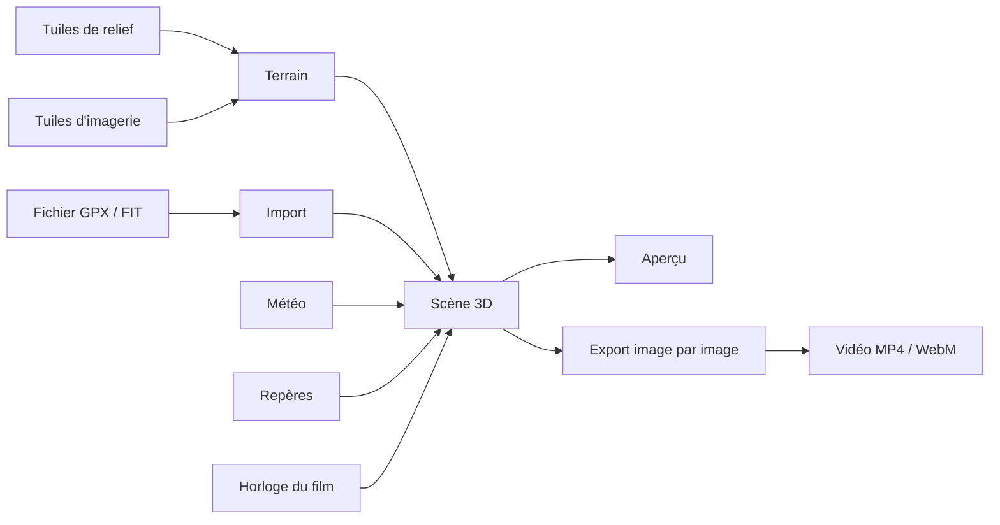

# OpenFlyover

OpenFlyover fait un film de survol 3D à partir d'une trace GPX ou FIT, sur le vrai relief, avec des données ouvertes.

- [Présentation](#présentation)
- [Captures d'écran](#captures-décran)
- [Démarrage rapide](#démarrage-rapide)
- [Utilisation](#utilisation)
- [Fonctionnement](#fonctionnement)
- [Déploiement sur un serveur](#déploiement-sur-un-serveur)
- [Application de bureau](#application-de-bureau)
- [Tests et qualité](#tests-et-qualité)
- [Sources de données et attributions](#sources-de-données-et-attributions)
- [Licences](#licences)
- [Architecture et contribution](#architecture-et-contribution)
- [Feuille de route](#feuille-de-route)

## Présentation

Vous importez la trace d'une sortie : randonnée, trail, vélo, ski de randonnée… OpenFlyover la pose sur un relief 3D
couvert d'orthophotos (photos aériennes redressées). Une caméra la survole, et vous exportez le résultat en vidéo.

Tout tourne dans le navigateur. Il n'y a ni compte, ni clé d'API, ni service payant, ni code côté serveur (l'import
Strava, facultatif, passe par votre propre application Strava). Vos fichiers
restent sur votre machine : le navigateur télécharge seulement le relief, l'imagerie, la météo et les repères auprès de
services ouverts.

Deux façons de l'utiliser :

- comme **site web statique**, en local ou sur votre propre serveur ;
- plus tard, comme **application de bureau** ([voir plus bas](#application-de-bureau)).

Ce qui existe aujourd'hui :

| Domaine | Fonctionnalités |
|---|---|
| Import | GPX et FIT, plusieurs traces à la fois, ou activités Strava ; fréquence cardiaque, cadence, puissance et température si présentes ; distance, D+ / D−, durée, altitudes |
| Relief et imagerie | relief Mapterhorn ou AWS Terrain Tiles ; orthophotos IGN en France et swisstopo en Suisse, choisies automatiquement ; Esri et Sentinel-2 ailleurs ; cartes topographiques ; photos IGN anciennes (1950–2005) ; exagération du relief ; lacs et rivières d'OpenStreetMap en eau qui reflète le ciel et le soleil, avec vaguelettes |
| Survol | cinq styles de caméra (poursuite, balancement, orbite, vue du dessus, plan cinématique), six préréglages, durée de 15 s à 10 min, profil altimétrique cliquable |
| Rythme | ralentis et pauses aux temps forts : sommets des montées, cols, sommets proches |
| Lumière | ciel et brume physiques, soleil à l'heure réelle de la sortie, ombres du relief, nuit étoilée, exposition automatique |
| Météo | météo historique du jour de la sortie (Open-Meteo), ou prévision pour une sortie à venir (jusqu'à 16 jours), visible dans un panneau et dans la scène ; nuages en volume tirés de la nébulosité basse, moyenne et haute (ou réglés à la main), poussés par le vent |
| Repères | sommets, cols, refuges, lacs… tirés d'OpenStreetMap ; montées détectées et classées (cat. 4 à HC) ; étiquettes 3D ; le film ralentit aux cols, sommets et refuges sur la trace et affiche leur nom |
| Points d'intérêt | vos propres lieux (« Pique-nique », « Le chalet de Paul »), posés d'un clic droit sur le relief ou au marqueur, affichés comme les repères dans la vue et le film |
| Trace | colorée selon la vitesse, la pente, l'altitude, le cardio, la cadence, la puissance ou la température ; épaisseur, tirets ou points, halo lumineux, trace qui se dessine au passage du marqueur |
| Marqueur | boule, figurine (randonneur, coureur, cycliste, VTT, skieur, parapente, voiture) tournée dans le sens de la marche, ou votre photo en rond ; taille réglable |
| Course fantôme | plusieurs traces rejouées ensemble, avec un classement en direct |
| Sortie prévue | pour un itinéraire sans heures (Komoot, Visorando, IGNrando…) : date, heure de départ, activité et rythme donnent l'heure de passage estimée à chaque point, le soleil et la prévision météo du jour |
| Feuille de route | avant de partir : les pentes raides (montées et descentes), les cols, sommets, refuges et points d'eau sur le chemin, avec le km, l'altitude, le D+ et l'heure de passage ; à copier ou à enregistrer en texte |
| Enchaînement | plusieurs traces (une par jour, ou une sortie enregistrée en deux fichiers) réunies en un seul parcours, survolé d'un trait |
| Habillage | titres, compteurs, profil, mini-carte, météo, logo, texte, classement de la course fantôme, textes, photos et vidéos de la timeline incrustés dans le film, crédits des sources ; trois styles, dont on peut changer les couleurs et les polices |
| Musique | une ou plusieurs musiques sur la timeline (MP3, M4A, OGG, WAV, FLAC), avec volume et fondus ; jouées pendant la lecture et mixées dans la vidéo exportée, avec le son des vidéos ; musique baissée sous les vidéos au choix |
| Export | vidéo MP4 ou WebM en 16:9, 9:16, 1:1, 4:5 ou 21:9, de 720p à 4K, à 24, 30 ou 60 images/s, avec la musique et le son des vidéos ; image fixe PNG ou JPEG |
| Affiche | affiche imprimable de la sortie en A4 ou A3 (300 dpi, portrait ou paysage) ou carrée : vue 3D de toute la trace, titre, date, chiffres clés, profil, météo du jour, crédits ; trois styles ; plusieurs traces sur la même affiche, chacune dans sa couleur, avec leur liste ou leur total ; « Carte à plat » pour une carte vue d'en haut |
| Projet | fichier de projet à enregistrer et rouvrir, annuler / rétablir, préréglages |

**En cours** sur la branche `timeline` : la timeline de montage, sous la vue 3D. Elle montre le film en pistes (plans,
arrêts, textes, médias) que vous déplacez et étirez à la souris. Le film est monté automatiquement au chargement : plan
d'ensemble, survol avec un arrêt à chaque temps fort, plan de clôture. Les textes, les photos et les vidéos s'affichent
dans le film.

## Captures d'écran


*L'interface avec la trace d'exemple : les onglets à gauche, la vue 3D cadrée au format de la vidéo, la timeline avec ses
plans, ses arrêts automatiques et ses pistes de textes et de photos.*


*Le montage : un clic sur un bloc de la timeline ouvre ses réglages à droite.*


*L'habillage (titre, date, crédits des sources) et le tiroir d'export : format, résolution, durée et taille estimées.*

## Démarrage rapide

Il vous faut :

- **Node.js 24** ;
- **Chrome ou Edge** récent. La vue 3D utilise WebGL 2 et l'export vidéo utilise WebCodecs, l'API d'encodage vidéo du
  navigateur. L'export n'a pas été testé sous Firefox ni Safari ;
- une carte graphique correcte : elle fait la vitesse de l'export ;
- une connexion Internet, pour les tuiles (les petites images carrées de relief et de carte).

```bash
git clone https://github.com/YannickRiou/gpx2movie.git
cd gpx2movie
npm ci
npm run dev
```

Ouvrez <http://127.0.0.1:5173> et cliquez sur « Charger l'exemple ».

Pour tester la version de production : `npm run build`, puis `npm run preview` (<http://localhost:4173>).

### Notes pour la machine de développement

- **WSL** : lancez `source ~/.nvm/nvm.sh && nvm use 24` avant `npm`.
- **Windows** : Node est installé par fnm, hors du PATH. Ajoutez-le avant `npm` :
  - PowerShell : `$env:Path = "C:\Users\MadCreator\AppData\Roaming\fnm\node-versions\v24.21.0\installation;" + $env:Path`
  - Git Bash : `export PATH="/c/Users/MadCreator/AppData/Roaming/fnm/node-versions/v24.21.0/installation:$PATH"`

## Utilisation

L'écran se lit comme un logiciel de montage :

- **en haut**, la barre du projet : nom, annuler / rétablir, « Ouvrir », « Enregistrer », le format de sortie au centre et
  le bouton **« Exporter »** à droite ;
- **à gauche**, une colonne d'icônes (Trace, Carte, Survol, Habillage, Projet) ; chaque icône ouvre son panneau. Cliquez à
  nouveau sur l'icône, ou tapez `[`, pour replier le panneau ;
- **au centre**, la vue 3D, cadrée au format de la vidéo ; **en dessous**, la timeline du film ;
- **tout en bas**, une fine bande d'état : chargement de la carte et sources des données (le bouton ⓘ affiche le texte
  complet).

L'appli se souvient de l'onglet ouvert et du panneau replié. Les messages (trace importée, projet enregistré, vidéo
prête, erreur…) s'affichent en bas de la vue ; les erreurs restent jusqu'à ce que vous les fermiez. Le bouton **?** de la
barre du haut (ou la touche `?`) liste tous les raccourcis clavier.

### Importer une trace

Glissez un ou plusieurs fichiers `.gpx` ou `.fit` n'importe où dans la fenêtre ; un fichier de projet `.json` déposé de
la même façon s'ouvre. Au premier lancement, la vue affiche aussi **« Choisir un fichier »** et **« Essayer avec l'exemple
(Tour du Mont-Blanc) »** (une étape synthétique). Ensuite, le petit bouton **« + Ajouter »** de la liste des traces en
ajoute d'autres. « Ouvrir » (Ctrl+O), dans la barre du haut, accepte aussi bien une trace qu'un projet. Les photos et les
vidéos se déposent, elles, sur la timeline.

La vue se cadre sur la trace. Si la trace est entièrement en France ou en Suisse, l'imagerie passe à l'IGN ou à swisstopo, sauf si vous avez déjà choisi une source.

La liste des traces affiche vos traces ; le bouton × en supprime une. Le survol, la météo, les repères et les montées
suivent la première trace. Dès deux traces, « Enchaîner en un seul parcours » les réunit en une seule (dans l'ordre des
heures de départ) ; le message propose « Annuler ».

Une trace sans heures (itinéraire préparé sur Komoot, Visorando…) a un volet « Prévoir la sortie » : choisissez la date,
l'heure de départ, l'activité et le rythme, puis « Calculer les horaires ». Le soleil, les compteurs et la météo
(prévision) suivent alors la sortie prévue ; « Effacer les horaires » revient à la trace sans heures.

#### Importer depuis Strava

Le bouton **« Strava »** de la liste des traces (ou **« Importer depuis Strava »** au premier lancement) importe vos
activités Strava directement. Strava demande une « application » pour cela ; OpenFlyover n'a pas de serveur, vous créez
donc la vôtre, une seule fois :

1. Sur [strava.com/settings/api](https://www.strava.com/settings/api), créez une application (gratuite). Nom et site
   au choix ; dans « Authorization Callback Domain », mettez `localhost` (site lancé sur votre machine, application de
   bureau) ou l'adresse de votre site s'il est hébergé (par exemple `flyover.example.org`).
2. Copiez son **Client ID** et son **Client Secret** dans OpenFlyover. Ils restent sur votre machine et ne sont envoyés
   qu'à Strava.
3. Cliquez sur **« Se connecter »** et autorisez la lecture de vos activités sur Strava.
4. Cochez les activités voulues (« Plus » pour remonter plus loin), puis **« Importer »**.

L'accès est en lecture seule, activités privées comprises, trace entière (zones de confidentialité comprises) :
pensez-y avant de publier un film. Strava limite chaque application à 100 requêtes par quart d'heure et 1 000 par jour
(une par page d'activités, une par activité importée). « Déconnecter » oublie la connexion ; l'accès se retire aussi sur
strava.com/settings/apps.

### Naviguer et lire

- Clic gauche glissé : tourner. Clic droit glissé : déplacer. Molette : zoomer.
- Le bouton en forme de viseur, en haut à droite de la vue (ou la touche F), revient à la vue d'ensemble.
- Dans la timeline, ▶ (ou Espace) lance le survol et ■ revient au début. Cliquez ou glissez sur le profil pour vous
  déplacer, ou utilisez les flèches ← → (une seconde, cinq avec Maj), Début et Fin. La vitesse va de ×0,5 à ×4.
- Cliquez sur la trace, dans la vue 3D, pour y placer la tête de lecture.
- En pause, vous tournez librement autour du marqueur.

### Monter le film

- Cliquez sur un bloc de la timeline : ses réglages s'ouvrent dans le panneau de droite. Échap le referme.
- « Arrêt » (ou la touche S) ajoute un arrêt à la position du marqueur, « Texte » (ou T) un texte à la tête de lecture.
- « Média » ajoute des photos et des vidéos à la tête de lecture (ou glissez-les sur la timeline). Une vidéo (MP4, WebM
  ou MOV, 50 Mo au plus) garde sa durée, 30 s au plus ; tirez ses bords pour la raccourcir. Elle garde son son : « Son de
  la vidéo » le coupe dans son panneau, qui règle aussi son volume. Pendant la lecture, il ne s'entend qu'à ×1. Photos et
  vidéos sont enregistrées dans le fichier du projet. Dans un projet d'avant, les vidéos restent muettes.
- Une vidéo filmée pendant la sortie (caméra embarquée, téléphone) peut être calée sur le parcours : « Caler sur le
  parcours » (dans le message après l'ajout, ou dans le panneau de la vidéo) la place au moment où le marqueur passe là où
  elle a été filmée. L'heure vient du fichier ; si la caméra n'est pas à l'heure, corrigez-la avec « Décalage de
  l'horloge » (en secondes, positif : la vidéo passe plus tard). « Suivre la vitesse du survol » fait défiler la vidéo au
  rythme du marqueur : plus vite quand le survol accélère, figée pendant un arrêt. La trace doit avoir des heures. La vidéo
  est alors muette : à ce rythme, son son serait déformé.
- « Options » › « Ajouter une musique… » pose un fichier audio (MP3, M4A, AAC, OGG, Opus, WAV ou FLAC, 30 Mo au plus) sur la
  piste « Musique », au début du film ou à la suite de la précédente (ou glissez-le sur la timeline). Le bloc montre la forme
  d'onde. Tirez ses bords pour le couper, réglez le volume et les fondus dans le panneau. « Caler la durée du film sur la
  musique » change la durée du survol pour que le film finisse avec elle. « Baisser la musique sous les vidéos » la baisse
  de 10 dB pendant les vidéos qui ont du son. La musique joue pendant la lecture ; le bouton haut-parleur de la barre
  coupe le son de la lecture, musique et vidéos (la vidéo exportée le garde). Elle est enregistrée dans le projet.
  « Caler sur le rythme » pose les arrêts et les titres sur les temps de la musique (de petites marques en haut du bloc).
- « Vitesse » fait passer 1 km de trace deux fois plus vite, à partir du marqueur (ou clic droit sur la trace, « Accélérer /
  ralentir ici ») ; tirez les bords du bloc, choisissez de ×0,25 à ×4 dans le panneau.
- Dans le panneau d'un arrêt, « Caméra pendant l'arrêt » : comme le film, tour lent autour du point, vue large ou fixe.
- Dans le panneau de l'ouverture, le style « Depuis la région » part de très haut au-dessus de la région, puis plonge vers la trace ; en clôture, la caméra y remonte.
- Dans le panneau de l'ouverture ou de la clôture, « Transition » : enchaîné (la caméra glisse), coupe nette, fondu au noir ou au blanc (avec sa durée).
- Onglet Survol, « Garder ce cadrage ici » pose un cadrage au marqueur (losange de la piste « Plans ») : réglez sa distance,
  son inclinaison et sa visée dans son panneau. La caméra passe en douceur d'un cadrage à l'autre, le reste du film ne change pas.
- Clic droit sur la trace, dans la vue 3D : « Ajouter un arrêt ici » ou « Ajouter un texte ici ».
- Le curseur de zoom et « Ajuster » règlent la largeur de la timeline. « Options » règle les arrêts automatiques.

### Le format de sortie

Les icônes du centre de la barre choisissent le format de la vidéo : 16:9, 9:16, 1:1, 4:5 ou 21:9. La vue 3D est alors
cadrée exactement comme la vidéo, avec des bandes sombres autour : ce que vous voyez est ce que vous exportez.
« Libre » (la première icône) remplit tout l'écran, pour regarder ; ce choix n'est pas enregistré dans le projet.

Le bouton en pointillés, sous le viseur (ou la touche G), affiche les **zones de sécurité** du format : en 16:9, 1:1 et
21:9 les marges « Action 93 % » et « Titres 90 % » ; en 9:16 et 4:5 les parties cachées par l'interface d'Instagram
Reels, TikTok et YouTube Shorts (barre du haut, boutons à droite, légende en bas), en hachuré. Elles ne servent qu'à
l'aperçu : la vidéo exportée ne les contient jamais.

### Les onglets

| Onglet | À quoi il sert |
|---|---|
| Trace | vos traces ; dès deux traces, la « Course fantôme » ; les montées détectées, la météo de la sortie et « Hors ligne » (sections repliables) |
| Carte | fond de carte, relief et trace, lumière (heure du soleil), atmosphère et météo, couleurs (étalonnage) ; repères OpenStreetMap |
| Survol | préréglage, style de caméra, durée du survol, rythme ; trace et marqueur |
| Habillage | en sections : Habillage (affiché ou non, style, « Couleurs et polices »), Titres, Compteurs, Profil et mini-carte, Météo, logo et texte, Crédits des sources |
| Projet | Mes projets, préréglages des réglages |

Les réglages rares sont rangés dans « Plus de réglages », en bas de chaque section. Dans « Lumière », choisissez « Heure
fixe » pour placer le soleil sur la journée, ou d'un clic : Lever, Matin, Midi, Heure dorée, Coucher, Nuit.

« Couleurs » étalonne l'image, à l'aperçu comme à l'export : Naturel (aucun changement), Lumineux, Doux, Contrasté, Chaud
du soir, Froid d'altitude, Noir et blanc ; « Plus de réglages » affine le contraste, la saturation, la température et le
vignettage.

Sans trace, les onglets Carte, Survol et Habillage vous invitent d'abord à en ajouter une. Chaque fonction s'allume ou
s'éteint avec un interrupteur ; les choix multiples (types de repères, compteurs) sont des pastilles à cocher.

« Trace et marqueur » (onglet Survol) choisit le marqueur : Boule, Figurine ou Image (une photo ou un avatar, recadré en
rond). La figurine regarde dans le sens où la trace avance à l'écran. « Trace qui se dessine » ne trace que la partie
déjà parcourue ; « Halo lumineux » entoure la trace d'un halo de sa couleur. « Plus de réglages » : épaisseur, trait
(plein, tirets, points), taille du marqueur. Pendant une course fantôme, les autres traces prennent le même marqueur dans
leur couleur, sauf l'image : elles gardent leur boule.

Dans l'onglet Trace, la météo tient en deux lignes : la sortie, puis l'instant du marqueur. « Détails » donne le reste.

La météo et les repères sont actifs par défaut. Éteignez-les : plus aucune requête ne part.

### « modifié » et « Par défaut »

Quand un réglage s'écarte de sa valeur par défaut, la pastille **« modifié »** apparaît à côté du titre de la section. Le
bouton **« Par défaut »** remet toute la section à zéro. « Annuler » dans le message, ou Ctrl+Z, annule ce retour.

La source d'imagerie n'est pas suivie, car l'import la choisit selon la région.

### Exporter une vidéo

1. Cliquez sur **« Exporter »** (Ctrl+E) : le volet d'export s'ouvre à droite. Sur un petit écran, le panneau de gauche se
   replie le temps de l'export.
2. Choisissez le format et la résolution. « Plus de réglages » donne les images par seconde, la qualité et le type d'image
   fixe.
3. Lisez le résumé : durée, nombre d'images, codec choisi par le navigateur, taille estimée. La vidéo ajoute 1 s fixe au
   début et 2 s à la fin.
4. Cliquez sur **« Exporter la vidéo »**. Dans Chrome, Edge et l'application de bureau, une fenêtre demande d'abord où
   enregistrer le fichier (« Enregistrement direct sur le disque ») : il s'écrit au fur et à mesure. Le film se calcule sous vos yeux, dans la vue. Chaque image attend que le relief
   visible soit chargé. Le bouton du haut affiche l'avancement (« 42 % · Annuler ») ; cliquez dessus pour arrêter.
5. La musique et le son des vidéos sont mixés dans la vidéo (AAC, ou Opus si le navigateur n'encode pas l'AAC). Si le navigateur n'encode aucun
   son, la vidéo sort muette et le panneau le dit.
6. À la fin, le panneau indique « Enregistrée dans … ». Dans les autres navigateurs, le fichier se télécharge à la fin et le
   lien « Télécharger… » reste affiché.

Gardez l'onglet ouvert. Sans écriture directe, la vidéo est construite en mémoire (environ deux fois sa taille) : au-delà
de 1,5 Go estimés, le panneau prévient. Annuler un export écrit sur le disque supprime le fichier commencé. Pendant
l'export, les onglets et le format sont bloqués.

Pour une **image fixe**, placez la lecture où vous voulez, puis cliquez sur « Image fixe » (PNG par défaut, JPEG dans « Plus
de réglages »). Elle a la taille de la vidéo et inclut l'habillage.

Pour poser l'habillage sur vos propres images dans un logiciel de montage, cochez **« Habillage seul (fond transparent) »**
avant d'exporter : compteurs, profil, carte, titres et crédits seuls, sans la vue 3D ni le son, dans une vidéo WebM
transparente qui tombe image pour image sur la vidéo normale.

Pour publier le même film en **plusieurs formats** (16:9 pour YouTube, 9:16 pour les stories, 1:1…), choisissez « Plusieurs
formats » en haut du volet d'export. Cochez les résolutions de chaque format, et si vous voulez l'image fixe et l'affiche.
Le résumé donne le nombre de fichiers, d'images et la taille totale ; après un premier film, il estime aussi la durée du
rendu. Cliquez sur **« Tout exporter »** : les fichiers sont calculés l'un après l'autre (« 2 / 4 · 16:9 1080p · 42 % »).
Dans Chrome, Edge et l'application de bureau, un dossier est demandé une fois et chaque fichier y est écrit, nommé
« <projet> – 16x9-1080p.mp4 » (un fichier du même nom est remplacé). Ailleurs, chaque fichier se télécharge dès qu'il est
prêt et la liste propose « Enregistrer à nouveau ». « Tout annuler » arrête le fichier en cours et ceux qui restent. Les
images par seconde et la qualité sont celles du mode « Vidéo ».

Pour une **affiche**, choisissez « Affiche » en haut du volet d'export. Réglez le format (A4 ou A3 à 300 dpi, portrait ou
paysage, ou carré pour les réseaux sociaux), le style, le titre (le nom du projet par défaut), le sous-titre et les
chiffres clés. La vignette montre la mise en page ; la vue 3D n'y apparaît qu'après une première affiche. Cliquez sur
« Créer l'affiche » : la vue de toute la trace, nord en haut, est rendue en haute résolution puis l'affiche est enregistrée
en PNG (« <projet> – affiche.png »). Les crédits des sources y figurent toujours, en petit. Les réglages de l'affiche sont
enregistrés dans le projet ; un préréglage n'en garde que le style.

### Préparer hors ligne

La section « Hors ligne » de l'onglet Trace télécharge une fois les tuiles de la trace : la vue et l'export marchent
ensuite sans connexion.

- Choisissez la largeur du couloir autour de la trace : 2, 5 ou 10 km. Au-delà, le relief reste plus grossier.
- L'estimation donne le nombre de tuiles et la taille avant de lancer : comptez plusieurs centaines de Mo pour 20 km.
- « Préparer hors ligne » lance le téléchargement : 4 tuiles à la fois, avec Pause, Reprendre et Annuler.
- Le pack vaut pour la trace, la source de relief, l'imagerie et le niveau de détail choisis à ce moment.
- Relancer avec la même trace et les mêmes réglages termine un pack incomplet.
- « Supprimer » libère la place. Sur le site, les tuiles restent dans le navigateur ; sur le bureau, dans le dossier de
  l'application.

Certaines sources interdisent le téléchargement en masse ; elles restent en ligne (voir
[Sources](#sources-de-données-et-attributions)).

### Enregistrer un projet

- Donnez un nom au projet directement dans la barre du haut (sinon, il prend le nom de la première trace).
- « Enregistrer » (Ctrl+S) télécharge un fichier `<nom>.openflyover.json`. Il contient les traces et tous les réglages.
  À côté du nom, « Modifié » signale des changements depuis le dernier enregistrement.
- « Ouvrir » (Ctrl+O) le recharge. Un réglage invalide reprend sa valeur par défaut et un message vous le signale.
- Les flèches d'annulation portent sur les réglages (Ctrl+Z, Ctrl+Maj+Z ou Ctrl+Y).
- « Garder dans Mes projets » (onglet « Projet ») garde le projet dans l'appli : il s'enregistre tout seul et se rouvre en un clic ; fermer
  l'appli ou l'onglet avec des changements non enregistrés demande d'abord confirmation.
- Les préréglages (onglet « Projet ») sont gardés dans le navigateur, sous le nom que vous leur donnez.

## Fonctionnement



- **Terrain** : les tuiles de relief deviennent des maillages. Un quadtree (découpage en quatre, de plus en plus fin)
  charge plus de détail près de la caméra. Une tuile reste affichée tant que ses quatre tuiles plus fines ne sont pas
  prêtes : le relief n'a jamais de trou.
- **Imagerie** : pour chaque tuile de relief, plusieurs tuiles d'imagerie sont assemblées en une seule texture.
- **Repère local** : la scène est centrée sur la trace. Les conversions de coordonnées se font en double précision en
  JavaScript, pour garder une précision au millimètre sur le GPU.
- **Survol** : la position de la caméra dépend seulement de la position sur la trace, du temps du film et des réglages.
  L'aperçu et l'export utilisent le même calcul : vous exportez ce que vous voyez.
- **Atmosphère** : un modèle physique de diffusion de la lumière (bibliothèque Takram) dessine le ciel, la brume et la
  lumière du soleil.
- **Export** : chaque image est rendue à la taille de la vidéo, l'habillage est dessiné par-dessus, puis WebCodecs
  l'encode. La bibliothèque mediabunny range les images dans un fichier MP4 ou WebM.

Le détail est dans [`ARCHITECTURE.md`](ARCHITECTURE.md).

## Déploiement sur un serveur

OpenFlyover est un site statique : pas de code serveur, pas de base de données. Un petit serveur personnel ou un
hébergement mutualisé (OVH par exemple) suffit. Votre serveur envoie seulement les fichiers du site. Le navigateur de
chaque visiteur va chercher lui-même les tuiles, la météo et les repères.

1. Construisez le site : `npm ci && npm run build`.
2. Copiez le contenu de `dist/` (environ 13 Mo) à la racine du site.
3. Servez-le en HTTPS.

### HTTPS obligatoire

Hors de `localhost`, le navigateur réserve certaines fonctions aux pages en HTTPS (un « contexte sécurisé ») :
l'encodeur vidéo de WebCodecs, mais aussi la création des identifiants de trace à l'import. En HTTP simple, ni l'import
ni l'export ne marchent. Un certificat Let's Encrypt ou celui de votre hébergeur suffit.

### nginx

```nginx
server {
    listen 443 ssl;
    server_name flyover.example.org;
    ssl_certificate     /etc/letsencrypt/live/flyover.example.org/fullchain.pem;
    ssl_certificate_key /etc/letsencrypt/live/flyover.example.org/privkey.pem;

    root /var/www/openflyover;

    location / {
        try_files $uri =404;
    }

    location /assets/ {
        add_header Cache-Control "public, max-age=31536000, immutable";
    }

    location /atmosphere/ {
        types { image/x-exr exr; application/octet-stream bin; }
    }
}
```

Les fichiers de `/assets/` ont une empreinte dans leur nom : on peut les garder en cache un an. Le dossier `/atmosphere/`
contient les textures du ciel, en `.exr` et `.bin`, deux types que nginx ne connaît pas.

### Apache

Sur un hébergement Apache, ajoutez un fichier `.htaccess` à la racine :

```apache
AddType image/x-exr .exr
AddType font/woff2 .woff2
```

### Limites connues

- Le site doit être servi **à la racine du domaine**. Quelques chemins sont écrits en dur : `/samples/` dans
  `src/ui/ImportPanel.tsx`, `/favicon.svg` dans `src/App.tsx` et `/fonts/` dans `src/ui/fonts.css`. Pour un sous-dossier,
  il faut construire avec `vite build --base=/sous-dossier/` et préfixer ces chemins par `import.meta.env.BASE_URL`.
- Un site public reste soumis aux conditions des sources ([voir plus bas](#sources-de-données-et-attributions)).
- Une longue vidéo prend beaucoup de mémoire (environ deux fois sa taille). L'écriture directe sur disque est prévue.

## Application de bureau

C'est le même code que le site, dans une fenêtre native [Tauri 2](https://v2.tauri.app/) (dossier `src-tauri/`). Les
boutons « Ouvrir » et « Enregistrer » et la fin d'un export ouvrent les fenêtres de fichiers du système. L'application
lit et écrit seulement les fichiers choisis dans ces fenêtres, et ses packs hors ligne dans son propre dossier
(`tiles/` du dossier de données de l'application). Tuiles, météo et repères viennent des mêmes sources qu'en ligne : il
faut Internet, sauf pour une trace préparée hors ligne.

Elle en est au premier incrément (phase 6). Elle n'a pas encore été lancée ni empaquetée sur une vraie machine.

### Prérequis

- Node.js 24 et les dépendances du site (`npm ci`) ;
- Rust stable (<https://rustup.rs>), 1.77 ou plus ;
- les bibliothèques du système, selon la plateforme :

| Système | À installer | Moteur web |
|---|---|---|
| Windows 10 / 11 | « Outils de génération C++ » de Visual Studio (MSVC). WebView2 est fourni avec Windows 11 ; l'installeur l'ajoute sinon | Edge (Chromium) |
| macOS 11 ou plus | `xcode-select --install` | Safari (WebKit) |
| Linux (Ubuntu 22.04, Debian 12 ou plus récent) | `sudo apt install libwebkit2gtk-4.1-dev build-essential curl wget file libxdo-dev libssl-dev libayatana-appindicator3-dev librsvg2-dev` | WebKitGTK |

Ubuntu 20.04 ne convient pas : il n'a ni `libwebkit2gtk-4.1` ni une GLib assez récente (2.70) pour Tauri 2.

### Lancer et construire

```bash
npm ci
npm run tauri:dev     # lance le serveur de développement puis la fenêtre ; recharge à chaque modification
npm run tauri:build   # construit dist/ puis l'application et ses installeurs
```

`tauri:build` dépose l'application dans `src-tauri/target/release/` et les installeurs dans
`src-tauri/target/release/bundle/` : `.msi` et `.exe` (NSIS) sous Windows, `.app` et `.dmg` sous macOS, `.deb`,
`.rpm` et `.AppImage` sous Linux. Chaque système construit ses propres installeurs. Ils ne sont pas signés : Windows et
macOS affichent un avertissement au premier lancement.

GitHub construit aussi les installeurs des trois systèmes (*Actions* › « Installeurs » › *Run workflow*, ou une étiquette
`v0.x.y` qui prépare une version brouillon), signés dès que les certificats sont ajoutés aux secrets du dépôt : voir
[`docs/installeurs.md`](docs/installeurs.md).

Les icônes de `src-tauri/icons/` viennent de `public/favicon.svg`. Pour les refaire : `npx tauri icon public/favicon.svg`
(puis garder seulement les fichiers listés dans `src-tauri/tauri.conf.json`).

### Limites actuelles

- **Export vidéo sous Linux** : WebKitGTK n'a pas WebCodecs ; l'application encode alors le film avec le `ffmpeg` du
  système, à installer (`sudo apt install ffmpeg`) : MP4 H.264, avec le son en AAC. Sans ffmpeg, le panneau d'export
  le dit et l'image fixe fonctionne ; l'habillage seul (WebM transparent) n'est pas encore possible
  ([`ARCHITECTURE.md`](ARCHITECTURE.md), « Export vidéo sans WebCodecs (Linux) » ; pas encore vérifié). Sous Windows (Edge)
  et sous macOS (WebKit, WebCodecs depuis Safari 16.4), l'export vidéo devrait passer par WebCodecs comme dans le
  navigateur (pas encore vérifié).
- Préférences et caches restent dans le stockage de la fenêtre (comme `localStorage` dans un navigateur), propre à
  l'application.

## Tests et qualité

| Commande | Rôle |
|---|---|
| `npm run dev` | serveur de développement sur <http://127.0.0.1:5173> |
| `npm run build` | vérification des types, puis version de production dans `dist/` |
| `npm run preview` | sert `dist/` sur <http://localhost:4173> |
| `npm test` | lance tous les tests (vitest) |
| `npx vitest run --maxWorkers=1` | les mêmes tests sur un seul cœur, plus stable sur une machine chargée |
| `npm run typecheck` | vérification des types TypeScript |
| `npm run lint` | analyse du code (oxlint) |
| `npm run e2e` | tests de bout en bout dans un vrai navigateur (voir plus bas) |

La suite compte **environ 1 200 tests** (8 octobre 2026). Chaque fichier de test est rangé à côté de son module
(`src/**/*.test.ts`). Les appels réseau et l'encodeur vidéo y sont simulés.

Les vérifications à faire à la main sur une machine avec une vraie carte graphique sont listées dans
[`docs/tests-gpu.md`](docs/tests-gpu.md).

### Tests de bout en bout

`npm run e2e` lance l'application dans un Chromium sans fenêtre et la pilote comme un utilisateur (`e2e/run.mjs`,
puppeteer-core). Le script démarre son propre serveur Vite sur un port libre. Cinq scénarios :

1. l'accueil vide, puis l'exemple chargé (plans Ouverture, Survol, Clôture) ;
2. chaque onglet du rail, puis l'aide des raccourcis (bouton et touche « ? », fermée par Échap) ;
3. la timeline : T ajoute un texte, Ctrl+Z le retire, S ajoute un arrêt ;
4. le projet enregistré, puis rouvert dans une page neuve (mêmes arrêts et textes) ;
5. l'export d'une petite vidéo (320 × 180, 2 s, 10 images par seconde) et d'une image fixe.

Un scénario échoue sur toute erreur de la console, sauf les erreurs réseau des tuiles, de la météo et d'OpenStreetMap.
Les tests utilisent les vrais serveurs de tuiles : il faut Internet. Une image dont les tuiles manquent est acceptée.
Pour l'export, les nuages sont coupés : en rendu logiciel, ils prennent plusieurs minutes par image.

Réglages par variables d'environnement :

| Variable | Rôle |
|---|---|
| `OPENFLYOVER_CHROME` | chemin de Chromium ou Chrome (par défaut, le Chromium de Playwright s'il est installé) |
| `OPENFLYOVER_E2E_SKIP_EXPORT=1` | saute l'export, le scénario le plus long |
| `OPENFLYOVER_E2E_ONLY=accueil,export` | ne lance que ces scénarios (`accueil`, `onglets`, `timeline`, `projet`, `export`) |

Sans carte graphique, le rendu passe par SwiftShader. Sur la machine de développement (WSL, sans GPU), la suite dure
environ 7 à 8 minutes, dont 5 à 6 pour l'export ; sans l'export, moins de 1 min 30. Les fichiers téléchargés et les captures des
échecs sont gardés dans le dossier affiché à la fin.

Ce qui n'est pas testé automatiquement : la qualité du rendu 3D et de la vidéo. Elle se vérifie à l'œil.

## Sources de données et attributions

Toutes les sources sont ouvertes et sans clé. Le code les déclare dans `src/terrain/sources.ts` ;
[`docs/sources.md`](docs/sources.md) détaille leurs vérifications (octobre 2026).

| Source | Sert à | Adresse | Attribution affichée |
|---|---|---|---|
| Mapterhorn | relief (par défaut) | `tiles.mapterhorn.com` | « © Mapterhorn (données ouvertes, liste des sources : mapterhorn.com/attribution) » |
| AWS Terrain Tiles | relief | `s3.amazonaws.com/elevation-tiles-prod` | « Terrain Tiles (Mapzen / AWS Open Data) — SRTM, GMTED2010, ETOPO1 courtesy of USGS/NOAA, EU-DEM © Copernicus, ArcticDEM et autres sources ouvertes » |
| IGN Géoplateforme | orthophotos et Plan IGN en France, photos de 1950 à 2005 | `data.geopf.fr/wmts` | « © IGN — Géoplateforme (BD ORTHO, licence ouverte Etalab 2.0) », et variantes par couche |
| swisstopo | orthophotos et carte nationale en Suisse | `wmts.geo.admin.ch` | « © swisstopo (SWISSIMAGE, OGD) », « © swisstopo (carte nationale, OGD) » |
| Esri World Imagery | orthophotos du monde (imagerie par défaut) | `services.arcgisonline.com` | « Source: Esri, Vantor, Earthstar Geographics, and the GIS User Community » |
| EOX Sentinel-2 cloudless 2025 | images satellite du monde, 10 m | `tiles.maps.eox.at` | « EOxCloudless https://cloudless.eox.at by EOX IT Services GmbH (Contains modified Copernicus Sentinel data 2025) — CC BY-NC-SA 4.0 » |
| OpenTopoMap | carte topographique du monde | `tile.opentopomap.org` | « Données : © contributeurs OpenStreetMap, SRTM \| Rendu : © OpenTopoMap (CC BY-SA) » |
| Open-Meteo | météo historique, prévision d'une sortie à venir | `archive-api.open-meteo.com`, `api.open-meteo.com` | « Données météo : Open-Meteo.com (CC BY 4.0) » |
| OpenStreetMap (API Overpass) | repères, plans d'eau (lacs et rivières reflétants) | `overpass-api.de`, secours `maps.mail.ru` | « © contributeurs OpenStreetMap (ODbL) » |

La bande d'état, en bas de l'écran, affiche les attributions du relief et de l'imagerie en cours. Celles d'Open-Meteo et d'OpenStreetMap
s'ajoutent quand la météo ou les repères sont chargés. Les mêmes lignes sont incrustées dans les vidéos et images exportées
([voir Licences](#licences)).

| Source | Licence | À savoir |
|---|---|---|
| Mapterhorn, AWS Terrain Tiles | données ouvertes (CC BY 4.0, OGL, domaine public…) | citer les sources |
| IGN | Licence Ouverte Etalab 2.0 | usage commercial permis |
| swisstopo | données ouvertes (OGD) | citer la source, usage raisonnable |
| Esri | conditions d'Esri | **à relire** avant tout usage commercial ; hors ligne en usage personnel seulement |
| EOX Sentinel-2 cloudless | CC BY-NC-SA 4.0 | **pas d'usage commercial** |
| OpenTopoMap | CC BY-SA | serveur bénévole : usage modéré ; une vidéo faite avec ce fond doit rester sous la même licence |
| Open-Meteo | CC BY 4.0 | API gratuite **non commerciale**, 10 000 requêtes par jour au plus |
| OpenStreetMap | ODbL | serveur public Overpass : usage modéré |

OpenFlyover est un projet personnel, non commercial : toutes les sources peuvent aller dans un pack hors ligne, avec une limite par jour plus basse pour celles qui découragent les téléchargements en masse :

| Source | Hors ligne | Pourquoi |
|---|---|---|
| Mapterhorn | oui, 20 000 tuiles par jour | données ouvertes ; Mapterhorn propose lui-même le téléchargement de zones ([accès aux données](https://mapterhorn.com/data-access)) |
| AWS Terrain Tiles | oui | archive publique AWS Open Data, faite pour être téléchargée ([registre](https://registry.opendata.aws/terrain-tiles/)) |
| IGN Géoplateforme | oui, 50 000 tuiles par jour (toutes couches) | Licence Ouverte Etalab 2.0 ; service public à ménager |
| EOX Sentinel-2 cloudless | oui, 20 000 tuiles par jour | CC BY-NC-SA 4.0 : copie permise hors usage commercial ([conditions](https://cloudless.eox.at/products/viewing)) |
| swisstopo | oui, usage personnel, 10 000 tuiles / jour | ses conditions demandent d'éviter les téléchargements automatiques en masse ([conditions](https://www.geo.admin.ch/en/general-terms-of-use-fsdi)) : gardez un couloir court |
| Esri World Imagery | oui, usage personnel, 10 000 tuiles / jour | Esri réserve normalement le hors ligne à ses applications (service « for Export ») : gardez un couloir court |
| OpenTopoMap | oui, usage personnel, 2 000 tuiles / jour | serveur bénévole qui demande d'éviter les téléchargements en masse ([à propos](https://opentopomap.org/about)) |

Une source dont les conditions ne sont pas vérifiées reste en ligne. Les limites par jour
comptent par appareil.

Pour ménager ces services, l'application :

- garde en mémoire les ~600 dernières tuiles et ne demande que celles de la vue ;
- envoie **une** requête météo par trace et la garde dans le navigateur ;
- envoie **une** requête de repères par trace, gardée 30 jours, et réessaie une seule fois si le serveur est saturé ;
- télécharge un pack hors ligne une seule fois, 4 tuiles à la fois, et ne redemande jamais une tuile déjà gardée ;
- envoie **une** requête de plans d'eau par trace (lacs et rivières dans un couloir de 8 km), dans la même file et le même
  cache, seulement si l'eau reflétante est cochée.

La trace elle-même ne part jamais. Ces services reçoivent seulement une position approchée : la zone des tuiles, quelques
points arrondis à 1 km avec leurs dates pour la météo, le rectangle autour de la trace pour les repères.

## Licences

Le code d'OpenFlyover est sous **licence MIT** ([`LICENSE`](LICENSE), © 2026 Yannick Riou).

| Dépendance | Version | Licence |
|---|---|---|
| three | 0.186.1 | MIT |
| @react-three/fiber, drei, postprocessing | 9.8.1, 10.7.9, 3.1.3 | MIT |
| postprocessing | 6.39.5 | Zlib |
| @takram/three-atmosphere, three-clouds, three-geospatial | 0.19.1, 0.7.6, 0.9.1 | MIT |
| mediabunny | 1.61.3 | MPL-2.0 : utilisable tel quel ; une modification de ses fichiers doit être publiée |
| zustand | 5.0.15 | MIT |
| react, react-dom | 19.3.0 | MIT |
| @garmin/fitsdk | 21.217.0 | licence FIT de Garmin (ci-dessous) |

**Garmin FIT SDK.** Ce n'est pas une licence libre. Garmin autorise gratuitement l'usage du format FIT dans vos logiciels,
mais interdit de redistribuer le SDK « sauf cas prévus ». Or le site publié contient le code du SDK. Ce point n'est pas
tranché : à vérifier avant une diffusion large. Le SDK n'est pas couvert par la licence MIT du projet.

Les outils de développement ne sont pas livrés avec le site : Vite, vitest, oxlint et jsdom sont sous MIT, TypeScript
sous Apache-2.0.

Fichiers embarqués :

- **Polices** Fraunces et IBM Plex, sous SIL Open Font License 1.1 ([`public/fonts/README.md`](public/fonts/README.md)).
- **Icônes** de l'interface : tracés de [Lucide](https://lucide.dev) (licence ISC, mention dans `src/ui/icons.tsx`),
  intégrés au code.
- **Textures du ciel** et catalogue d'étoiles, issus du paquet `@takram/three-atmosphere` (MIT), et **textures des
  nuages** (météo locale, formes, turbulence) du paquet `@takram/three-clouds` (MIT). Le site les sert lui-même. Les étoiles viennent du Yale Bright Star Catalog, dont la licence n'est pas indiquée.
- **Géoïde EGM96** (grille 1°, `src/geo/egm96Grid.ts`), tiré par `scripts/gen-geoid.mjs` de la grille 15' de la NGA
  redistribuée par PROJ-data (`us_nga_egm96_15.tif`), domaine public.
- **Trace d'exemple**, synthétique, générée par `scripts/gen-sample-gpx.mjs`.

**Vidéos exportées.** Elles contiennent des données cartographiques sous leur propre licence
([voir les sources](#sources-de-données-et-attributions)). Vous devez donc citer ces sources quand vous diffusez une
vidéo. L'application les incruste en petit dans un coin de chaque vidéo et image fixe exportée, et au bas de chaque affiche (mêmes lignes que la barre
d'état : relief, imagerie, et Open-Meteo / OpenStreetMap quand la météo ou les repères sont chargés). Ces crédits se
désactivent dans le panneau Habillage (« Crédits des sources ») : citez alors les sources ailleurs, par exemple dans la
description de la vidéo.

## Architecture et contribution

- [`ARCHITECTURE.md`](ARCHITECTURE.md) : coordonnées, contrats partagés, modules. À lire avant de coder.
- [`docs/reprise.md`](docs/reprise.md) : état du projet et prochaines étapes.
- [`docs/sources.md`](docs/sources.md) : vérification des sources de données.

Conventions :

- TypeScript strict, avec `import type` et sans `enum`.
- Interface en français.
- Charte graphique dans [`src/ui/theme.css`](src/ui/theme.css).
- Sources ouvertes uniquement, sans clé ; toute nouvelle source va dans `src/terrain/sources.ts` et `docs/sources.md`.
- Types, lint et tests au vert avant chaque commit, un commit par fonctionnalité.

## Feuille de route

État détaillé, travaux en cours et reprise : [`docs/reprise.md`](docs/reprise.md).

| Phase | Contenu |
|---|---|
| 1 — Visionneuse (fait) | import GPX / FIT, relief streamé, imagerie composée, trace plaquée, caméra orbitale |
| 2 — Survol (fait) | caméra de survol automatique le long de la trace, timeline, lecture / pause, vitesse, marqueur de progression, profil altimétrique |
| 3 — Atmosphère (fait) | fait : ciel et diffusion atmosphérique (modèle Takram), brume de distance, soleil et heure solaire, ciel de nuit étoilé, exposition automatique et correction, ombres portées du relief, météo réelle dans la scène (soleil voilé, brume, brouillard, ombres adoucies), nuages volumétriques (Takram, pilotés par la météo ou à la main), eau réfléchissante (lacs et rivières d'OpenStreetMap : reflets du ciel et du soleil, vaguelettes, fondu sur la rive), fonds de carte topographiques (Plan IGN, carte nationale suisse, OpenTopoMap), hauteurs calées sur le niveau de la mer (géoïde EGM96 pour l'atmosphère et les nuages) — l'aquarelle (Stadia) exige une clé, exclue |
| 4 — Personnalisation (en cours) | fait : document de projet (enregistrer / ouvrir un fichier autonome), annuler / rétablir, préréglages, pastille « modifié » et bouton rétablir par panneau, modèle du film et son moteur, timeline de montage sous la vue, ses textes, ses photos et ses vidéos dans le film (incréments 1 à 4 sur 4), vitesse par portion de trace, son des vidéos ; à venir : tout le film est réglable : caméra, rythme, titres, données affichées, style de trace, points d'intérêt, rendu, format (détail ci-dessous) |
| 5 — Export vidéo (en cours) | fait : rendu hors écran image par image, formats paysage, vertical, carré, portrait, cinéma × résolutions 720p à 4K (24 / 30 / 60 i/s ; trois qualités), attente des seules tuiles visibles et préchargement, habillage incrusté, encodage MP4 H.264 (repli HEVC, WebM VP9 / VP8) via WebCodecs, progression, temps restant, annulation, téléchargement, image fixe PNG / JPEG de la vue courante aux mêmes formats × résolutions, habillage compris, écriture directe sur le disque (Chrome, Edge, application de bureau ; repli en mémoire ailleurs) ; reste : mesure de la vitesse sur une machine avec GPU |
| 6 — Application de bureau (en cours) | fait : projet Tauri 2 (`src-tauri/`), couche plateforme commune au site et au bureau (`src/platform/`), fenêtres natives pour ouvrir et enregistrer projets, traces et exports, films écrits directement sur le disque, packs de tuiles hors ligne (couloir autour de la trace, site et bureau) ; encodeur vidéo par le ffmpeg du système sous Linux (WebKitGTK n'a pas WebCodecs, à vérifier) ; reste : stockage local des projets et préréglages, installeurs signés |
| 7 — Au-delà du survol | fonctionnalités propres à OpenFlyover : lumière et météo réelles de la sortie, trace colorée par les données, course fantôme, vidéo embarquée synchronisée, repères automatiques, rendu en lot, affiche, calage musical, reconnaissance (détail ci-dessous) |

### Phase 4 — Personnalisation

Principe : chaque réglage vit dans un **document de projet unique** (JSON versionné) — enregistrable, rechargeable,
partageable, avec préréglages et annuler / rétablir. L'aperçu et l'export lisent ce même document : ce qu'on voit est
ce qui sera rendu.

| Domaine | Réglages |
|---|---|
| Timeline (montage) | comme un logiciel de montage, la base est le survol continu de la trace, avec des pistes séparées au-dessus : arrêts (orbite ou caméra fixe), titres et textes placés et étirés librement dans le temps, points d'intérêt avec arrêt, médias (images, vidéos) ; film assemblé automatiquement au chargement (ouverture en vue d'ensemble → survol avec arrêts aux sommets, cols et montées → clôture en vue d'ensemble), puis retouché. Quatre incréments : 1 — modèle du film et moteur (horloge du film, plans d'ouverture et de clôture « descente » ou « saut », arrêts, aperçu et export identiques) **fait** ; 2 — timeline sous la vue (pistes plans / arrêts / textes, glisser pour déplacer et étirer avec aimantation, zoom, inspecteur, film assemblé avec un arrêt en orbite à chaque temps fort) **fait** ; 3 — piste des textes dessinée dans l'habillage (aperçu et export, fondus, empilés par position ; cartes d'ouverture et de clôture calées sur le temps du film) **fait** ; 4 — piste des médias : photos plein écran (mouvement lent) ou en carte encadrée, placées là où elles ont été prises (position GPS ou heure de la photo), enregistrées dans le projet **fait** ; vidéos (MP4, WebM, MOV de 50 Mo au plus, découpables, image exacte à l'export) **fait** ; son des vidéos (volume, musique baissée dessous au choix, mixé à l'export) **fait** |
| Rythme | **fait** : durée totale réglable (15 s–10 min) ; ralentis et pauses aux temps forts (sommets des montées, cols franchis, sommets proches), durée du film conservée ou allongée ; vitesse par portion choisie à la main (piste « Vitesse », ×0,25 à ×4, transitions douces) ; plan de situation (ouverture « Depuis la région » qui plonge vers la trace) ; à faire : ouverture et fermeture « balayage » ou « saut », transitions entre sections réglables |
| Caméra | **fait** : styles poursuite, balancement (hélicoptère), orbite, vue du dessus, plan cinématique ; préréglages nommés ; distance, tangage, cap, lissage ; caméra de chaque arrêt (comme le film, tour lent, vue large, fixe) et cadrages le long de la trace (losanges de la piste « Plans ») ; à faire : caméra propre à une photo ou une note |
| Titres et textes | titre d'ouverture, sous-titres, générique de fin, étiquettes posées sur le relief (sommets, cols, villages) ; police, couleur, position, apparition et durée |
| Données à l'écran | **fait** : habillage dessiné sur canvas (même rendu en aperçu et à l'export), trois styles (éditorial, diffusion sombre, application claire), carte d'ouverture, carte de clôture (distance, D+, altitude max, durée, vitesse max, météo), compteurs au choix, profil de dimensions réglables, mini-carte (partie parcourue, flèche du nord), météo au marqueur, logo, texte libre, 9 positions et une taille par widget ; étiquettes 3D effacées derrière les cartes ; à faire : couleurs et polices par widget. Prévu à l'origine : compteurs (distance, altitude, D+, vitesse, fréquence cardiaque, temps), profil altimétrique (dimensions réglables), mini-carte, logo, texte libre, carte de clôture (altitude max, vitesse max…) ; styles d'habillage prédéfinis (éditorial, diffusion sombre, application claire) ; position, taille et style de chaque widget |
| Trace | couleur, épaisseur, style (pleine, pointillée, lumineuse sans perte de teinte), trace qui se dessine au fil du survol, enchaînement de plusieurs traces, trace affichée mais exclue du survol ; marqueurs départ / progression / arrivée en figurines 3D animées selon la vitesse et la pente (randonneur, coureur, alpiniste, skieur de randonnée, cycliste route et VTT, bikepacking, moto, parapente, avion léger) ou en autocollant / avatar personnel |
| Points d'intérêt | ajout manuel ou depuis les waypoints GPX, photos géolocalisées, icônes, types d'épingles ; un seul réglage de timing (apparition / disparition) pour waypoints, photos, bornes kilométriques, départ et arrivée |
| Rendu | sources de relief et d'imagerie, exagération, atmosphère (date, heure, brume), étalonnage (exposition, contraste, saturation, vignettage) |
| Format | ratio 16:9 / 9:16 / 1:1 / 4:5, résolution, cadence, zones de sécurité affichées |
| Thèmes | habillage du film (polices, couleurs des titres et widgets) indépendant de l'interface, thèmes fournis et personnalisés ; styles de carte, d'éléments et d'habillage enregistrables séparément |
| Éditeur | une page, cinq modes (Trajet, Carte, Habillage, Survol, Prises de vue) sans recharger la scène ; onglets Contenu / Style / Visibilité par élément ; pastille « modifié » et bouton rétablir sur tout réglage qui s'écarte du style ; prises de vue enregistrées (caméra, cadrage, lumière) pour des images fixes |

### Phase 7 — Au-delà du survol

Ce qui distingue OpenFlyover : tout reste local, et les données de la sortie (horodatage, capteurs, lieu) pilotent le film.

| Fonctionnalité | Contenu | État |
|---|---|---|
| Lumière réelle de la sortie | le soleil suit l'horodatage de chaque point : on revit le lever ou le coucher de soleil au bon endroit, ombres portées comprises | fait |
| Météo historique | température, ressenti, vent et rafales, nuages (3 couches), pluie et neige heure par heure sur la trace, du jour de la sortie (archive Open-Meteo depuis 1940, sans clé, cache local) : bilan de la sortie et conditions au marqueur dans le panneau ; rendu dans la scène (voile, brume, ombres) et widget du film | fait ; nuages volumétriques à faire |
| Trace colorée par une donnée | vitesse, pente, fréquence cardiaque, puissance, en échelle séquentielle perceptuellement uniforme (viridis, magma…) avec légende | fait (vitesse, pente, altitude, FC, cadence, puissance, température) |
| Course fantôme | plusieurs traces rejouées ensemble sur leur temps réel : comparer des amis, ou ses sorties successives sur un même parcours | marqueurs synchronisés (temps écoulé, heure réelle, même distance) et classement en direct : fait ; classement dans l'habillage du film à faire |
| Vidéo embarquée synchronisée | incrustation d'une vidéo GoPro / Insta360 calée sur l'horodatage ; export de l'habillage seul sur fond transparent pour le montage | vidéo calée sur l'heure de la trace (heure lue dans le fichier, décalage réglable, défilement au rythme du survol) : fait ; export de l'habillage seul à faire |
| Repères automatiques | sommets, cols, refuges et lacs tirés d'OpenStreetMap avec leur altitude ; montées détectées et catégorisées, qui déclenchent ralentis et titres | montées (cat. 4 à HC), waypoints GPX et repères OpenStreetMap (sommets, cols, refuges, lacs… à 0,1–3 km, une requête Overpass par trace en cache) étiquetés en 3D : fait ; ralentis et titres à faire |
| Rendu en lot | le même film en plusieurs formats d'un coup ; un dossier de GPX et un préréglage → une vidéo par sortie, en ligne de commande, sans interface | plusieurs formats (format × résolution, image fixe, affiche) en une fois, dans un dossier choisi : fait ; une vidéo par trace d'un dossier, depuis l'interface : fait ; en ligne de commande à faire |
| Affiche imprimable | la trace sur le relief en très haute résolution, avec titre et chiffres, pour un tirage | A4 / A3 à 300 dpi (portrait, paysage) et carré, vue d'ensemble 3D, titre, date, chiffres clés, profil, météo, crédits, trois styles : fait ; plusieurs traces, carte à plat à faire |
| Calage musical | le rythme du survol (ralentis, transitions) aligné sur les temps forts d'une musique locale | piste « Musique » (volume, fondus, forme d'onde), jouée dans l'aperçu, mixée à l'export, durée du film calée sur la musique, arrêts et titres calés sur le rythme : fait ; caler les ralentis sur le rythme à faire |
| Reconnaissance | tracer un itinéraire futur sur le relief (routage OSM local) pour le survoler avant d'y aller | à faire |
