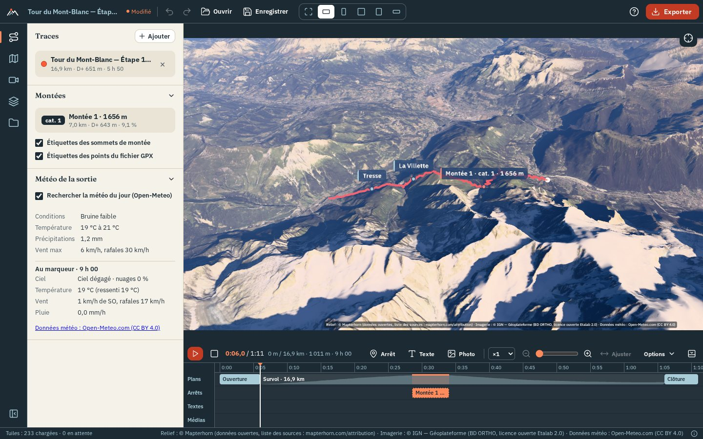

# OpenFlyover

[](https://github.com/YannickRiou/gpx2movie/actions/workflows/ci.yml)
[](https://github.com/YannickRiou/gpx2movie/actions/workflows/desktop.yml)
[](LICENSE)
[](https://nodejs.org/)
[](https://www.typescriptlang.org/)
[](https://react.dev/)
[](https://threejs.org/)
[](https://vite.dev/)
[](https://v2.tauri.app/)
[](https://vitest.dev/)

OpenFlyover makes a 3D flyover movie from a GPX or FIT track, over the real terrain, with open data.

- [Overview](#overview)
- [Quick start](#quick-start)
- [Documentation](#documentation)
- [Deploying](#deploying)
- [Tests and quality](#tests-and-quality)
- [Data sources](#data-sources)
- [Licenses](#licenses)
- [Contributing](#contributing)
- [Roadmap](#roadmap)

## Overview

You import the track of an outing: hiking, trail running, cycling, ski touring… OpenFlyover lays it on 3D terrain
covered with orthophotos (orthorectified aerial photos). A camera flies over it, you edit the film on a timeline, and
you export the result as a video, a still image or a printable poster.

Everything runs locally. There is no account, no API key, no paid service and no server-side code (the optional
Strava import goes through your own Strava application). Your files stay on your machine: the app only downloads
terrain, imagery, weather and landmarks from open services. It runs as a **static website** or as a Windows, macOS or
Linux **desktop application** (Tauri), from the same code.



| Area | Features |
|---|---|
| Import | GPX and FIT, several tracks at once, or Strava activities; heart rate, cadence, power and temperature when present; distance, elevation gain / loss (D+ / D−), duration, elevations |
| Terrain and imagery | Mapterhorn or AWS Terrain Tiles terrain; IGN orthophotos in France and swisstopo in Switzerland, chosen automatically; Esri and Sentinel-2 elsewhere; topographic maps; historical IGN photos (1950–2005); terrain exaggeration; OpenStreetMap lakes and rivers rendered as water that reflects the sky and the sun, with ripples |
| Flyover | five camera styles (chase, sway, orbit, top-down view, cinematic shot), six presets, duration from 15 s to 10 min, clickable elevation profile |
| Pacing | slow-motion and pauses at highlights: tops of climbs, passes, nearby summits |
| Light | physically based sky and haze, sun at the actual time of the outing, terrain shadows, starry night, automatic exposure |
| Weather | historical weather for the day of the outing (Open-Meteo), or the forecast for an upcoming outing (up to 16 days), shown in a panel and in the scene; volumetric clouds derived from low, mid and high cloud cover (or set by hand), pushed by the wind |
| Landmarks | summits, passes, huts, lakes… from OpenStreetMap; climbs detected and categorized (cat. 4 to HC); 3D labels; the movie slows down at passes, summits and huts on the track and shows their name |
| Scouting | an outing not done yet, drawn by placing points on the terrain: the route follows OpenStreetMap paths, with its elevations, and is flown over like a track |
| Planned outing | for a route without times (Komoot, Visorando, IGNrando, or drawn in "Préparer une sortie"): date, start time, activity and pace give the estimated passing time at each point, the sun and the weather forecast of the day |
| Roadbook | before setting off: the steep sections (up and down), the passes, summits, huts and water points on the way, with the km, elevation, D+ and passing time; to copy or save as text |
| Points of interest | your own places ("Picnic", "Paul's chalet"), placed with a right-click on the terrain or at the marker, with an icon (hut, bivouac, summit…), shown like landmarks in the view and in the movie |
| Track | colored by speed, slope, elevation, heart rate, cadence, power or temperature; width, dashes or dots, glow, track that draws itself as the marker passes |
| Marker | ball, figurine (hiker, mountaineer, runner, cyclist, bikepacking, mountain bike, skier, paraglider, motorbike, car, light aircraft) facing the direction of travel, or your photo in a circle; adjustable size |
| Ghost race | several tracks replayed together, with a live leaderboard |
| Chaining | several tracks (one per day, or one outing recorded in two files) merged into a single route, flown over in one go |
| Overlay | titles, counters, profile, mini-map, weather, logo, text, ghost race leaderboard, texts, photos and videos from the timeline burned into the movie, source credits; three styles whose colors and fonts can be changed, for the whole overlay or element by element |
| Music | one or more music tracks on the timeline (MP3, M4A, OGG, WAV, FLAC), with volume and fades; played during playback and mixed into the exported video, with the sound of the videos; music optionally lowered under the videos |
| Export | MP4 or WebM video in 16:9, 9:16, 1:1, 4:5 or 21:9, from 720p to 4K, at 24, 30 or 60 frames per second, with the music and the sound of the videos; PNG or JPEG still image |
| Poster | printable poster of the outing in A4 or A3 (300 dpi, portrait or landscape) or square: 3D view of the whole track, title, date, key figures, profile, weather of the day, credits; three styles; several tracks on the same poster, each in its color, with their list or their total; "Carte à plat" (flat map) for a map seen from above |
| Project | project file to save and reopen, undo / redo, presets |

How to use each of these: the [user guide](docs/user-guide.html).

## Quick start

You need:

- **Node.js 24**;
- a recent **Chrome or Edge**. The 3D view uses WebGL 2 and video export uses WebCodecs, the browser's video encoding
  API. Export has not been tested in Firefox or Safari;
- a decent graphics card: it sets the export speed;
- an Internet connection, for the tiles (the small square images of terrain and map).

```bash
git clone https://github.com/YannickRiou/gpx2movie.git
cd gpx2movie
npm ci
npm run dev
```

Open <http://127.0.0.1:5173> and click "Essayer avec l'exemple (Tour du Mont-Blanc)" (try with the sample).

To test the production build: `npm run build`, then `npm run preview` (<http://localhost:4173>).

### Notes for the development machine

- **WSL**: run `source ~/.nvm/nvm.sh && nvm use 24` before `npm`.
- **Windows**: Node is installed by fnm, outside the PATH. Add it before `npm`:
  - PowerShell: `$env:Path = "C:\Users\MadCreator\AppData\Roaming\fnm\node-versions\v24.21.0\installation;" + $env:Path`
  - Git Bash: `export PATH="/c/Users/MadCreator/AppData/Roaming/fnm/node-versions/v24.21.0/installation:$PATH"`

## Documentation

| Document | For |
|---|---|
| [User guide](docs/user-guide.html) | using the app: import, planning, editing, export, offline, shortcuts |
| [Knowledge base](docs/how-it-works.html) | how the app is built, explained for newcomers to web development |
| [`ARCHITECTURE.md`](ARCHITECTURE.md) | coordinates, shared contracts, modules: read it before coding |
| [Deploying and building](docs/deploying.md) | web server setup (HTTPS, nginx, Apache), desktop application build |
| [Desktop installers](docs/installers.md) | installers built on GitHub, signing |
| [Data sources](docs/sources.md) | attributions, licenses, offline rules and how each source was checked |
| [GPU tests](docs/tests-gpu.md) | manual checks on a machine with a real graphics card |
| [Roadmap](docs/roadmap.md) | phases and what each one contains |
| [Handover](docs/handover.md) | project status and next steps |

The HTML pages are standalone: open them in a browser from a clone, or through any static host.

## Deploying

OpenFlyover is a static site: build it with `npm ci && npm run build`, copy `dist/` to the root of a domain and serve
it over **HTTPS** (the video encoder and track import need a secure context outside `localhost`). The desktop
application is built with `npm run tauri:build`; installers for the three systems are also built on GitHub
(*Actions* › "Desktop installers"). Details, server configuration and limitations: [`docs/deploying.md`](docs/deploying.md).

## Tests and quality

| Command | Purpose |
|---|---|
| `npm run dev` | development server on <http://127.0.0.1:5173> |
| `npm run build` | type check, then production build in `dist/` |
| `npm run preview` | serves `dist/` on <http://localhost:4173> |
| `npm test` | runs all tests (vitest) |
| `npx vitest run --maxWorkers=1` | the same tests on a single core, more stable on a busy machine |
| `npm run typecheck` | TypeScript type check |
| `npm run lint` | code analysis (oxlint) |
| `npm run e2e` | end-to-end tests in a real browser (see below) |

The suite has **about 1,540 tests** (9 October 2026), each file next to its module (`src/**/*.test.ts`); network calls
and the video encoder are mocked. `npm run e2e` drives the app in a headless Chromium through six scenarios (home,
tabs, timeline, project, export, scouting); its options are documented at the top of `e2e/run.mjs`. The rendering
quality is checked by eye ([`docs/tests-gpu.md`](docs/tests-gpu.md)).

## Data sources

All sources are open and keyless; the code declares them in `src/terrain/sources.ts`.

| Source | Used for | License |
|---|---|---|
| Mapterhorn, AWS Terrain Tiles | terrain | open data (CC BY 4.0, OGL, public domain…) |
| IGN Géoplateforme | orthophotos, Plan IGN and historical photos in France | Licence Ouverte Etalab 2.0 |
| swisstopo | orthophotos and national map in Switzerland | open data (OGD) |
| Esri World Imagery | world orthophotos (default imagery) | Esri terms, **to be reviewed** before commercial use |
| EOX Sentinel-2 cloudless | world satellite images | CC BY-NC-SA 4.0, **no commercial use** |
| OpenTopoMap | world topographic map | CC BY-SA |
| Open-Meteo | historical weather and forecast | CC BY 4.0, **non-commercial** API |
| OpenStreetMap (Overpass, Nominatim) | landmarks, water bodies, scouting paths, place search | ODbL |

The track itself is never sent: services only receive the tile area, a few points rounded to 1 km for the weather and
the rectangle around the track for landmarks. Displayed attributions, offline-pack rules, request limits and the
verification log: [`docs/sources.md`](docs/sources.md).

## Licenses

The OpenFlyover code is under the **MIT license** ([`LICENSE`](LICENSE), © 2026 Yannick Riou).

| Dependency | Version | License |
|---|---|---|
| three | 0.186.1 | MIT |
| @react-three/fiber, drei, postprocessing | 9.8.1, 10.7.9, 3.1.3 | MIT |
| postprocessing | 6.39.5 | Zlib |
| @takram/three-atmosphere, three-clouds, three-geospatial | 0.19.1, 0.7.6, 0.9.1 | MIT |
| mediabunny | 1.61.3 | MPL-2.0: usable as is; a modification of its files must be published |
| zustand | 5.0.15 | MIT |
| react, react-dom | 19.3.0 | MIT |
| @garmin/fitsdk | 21.217.0 | Garmin FIT license (below) |

**Garmin FIT SDK.** This is not a free license. Garmin allows free use of the FIT format in your software,
but forbids redistributing the SDK "except as provided". The published site, however, contains the SDK code. This point
is not settled: it must be checked before a wide release. The SDK is not covered by the MIT license of the project.

The development tools are not shipped with the site: Vite, vitest, oxlint and jsdom are under MIT, TypeScript
under Apache-2.0.

Embedded files:

- **Fonts** Fraunces and IBM Plex, under SIL Open Font License 1.1 ([`public/fonts/README.md`](public/fonts/README.md)).
- Interface **icons**: paths from [Lucide](https://lucide.dev) (ISC license, notice in `src/ui/icons.tsx`),
  built into the code.
- **Sky textures** and star catalog, from the `@takram/three-atmosphere` package (MIT), and **cloud
  textures** (local weather, shapes, turbulence) from the `@takram/three-clouds` package (MIT). The site serves them itself. The stars come from the Yale Bright Star Catalog, whose license is not stated.
- **EGM96 geoid** (1° grid, `src/geo/egm96Grid.ts`), derived by `scripts/gen-geoid.mjs` from the NGA 15' grid
  redistributed by PROJ-data (`us_nga_egm96_15.tif`), public domain.
- **Sample track**, synthetic, generated by `scripts/gen-sample-gpx.mjs`.

**Exported videos.** They contain map data under its own license
([see the sources](#data-sources)). You must therefore credit these sources when you distribute a
video. The application burns them in small print into a corner of each exported video and still image, and at the bottom of each poster (same lines as the status
bar: terrain, imagery, and Open-Meteo / OpenStreetMap when the weather or the landmarks are loaded). These credits can be
turned off in the "Habillage" panel ("Crédits des sources"): then credit the sources elsewhere, for example in the
video description.

## Contributing

Conventions:

- Strict TypeScript, with `import type` and no `enum`.
- Interface in French.
- Visual identity in [`src/ui/theme.css`](src/ui/theme.css).
- Open, keyless sources only; any new source goes into `src/terrain/sources.ts` and `docs/sources.md`.
- Types, lint and tests green before each commit, one commit per feature.

## Roadmap

| Phase | Status |
|---|---|
| 1 — Viewer | done |
| 2 — Flyover | done |
| 3 — Atmosphere | done |
| 4 — Customization | done |
| 5 — Video export | in progress: speed measurement on a machine with a GPU |
| 6 — Desktop application | in progress: first run of the workflows, signing |
| 7 — Beyond the flyover | done |

Content of each phase: [`docs/roadmap.md`](docs/roadmap.md).
