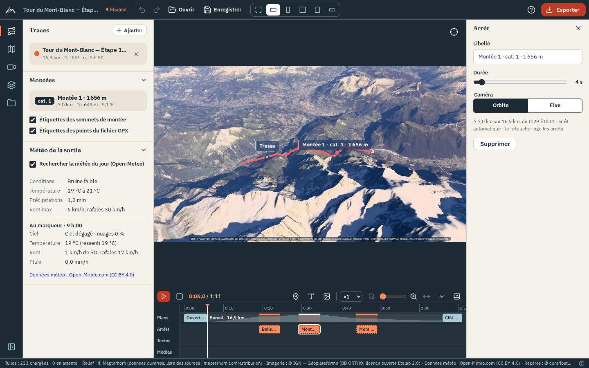
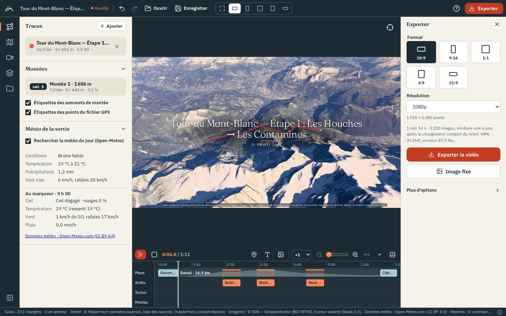
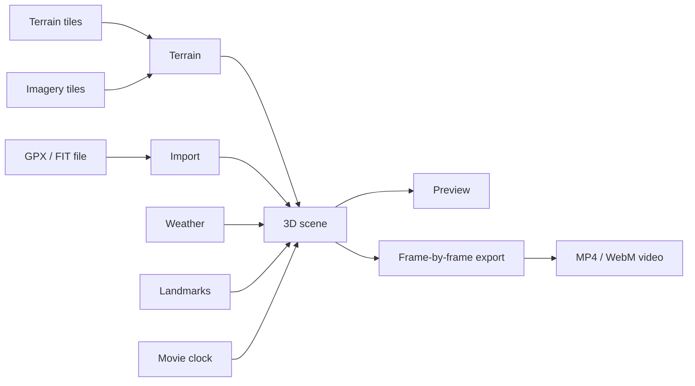

# OpenFlyover

[](https://github.com/YannickRiou/gpx2movie/actions/workflows/ci.yml)
[](https://github.com/YannickRiou/gpx2movie/actions/workflows/desktop.yml)
[](LICENSE)
[](https://nodejs.org/)
[](https://www.typescriptlang.org/)
[](https://react.dev/)
[](https://threejs.org/)
[](https://vite.dev/)
[](https://v2.tauri.app/)
[](https://vitest.dev/)

OpenFlyover makes a 3D flyover movie from a GPX or FIT track, over the real terrain, with open data.

- [Overview](#overview)
- [Screenshots](#screenshots)
- [Quick start](#quick-start)
- [Usage](#usage)
- [How it works](#how-it-works)
- [Deploying to a server](#deploying-to-a-server)
- [Desktop application](#desktop-application)
- [Tests and quality](#tests-and-quality)
- [Data sources and attributions](#data-sources-and-attributions)
- [Licenses](#licenses)
- [Architecture and contributing](#architecture-and-contributing)
- [Roadmap](#roadmap)

## Overview

You import the track of an outing: hiking, trail running, cycling, ski touring… OpenFlyover lays it on 3D terrain
covered with orthophotos (orthorectified aerial photos). A camera flies over it, and you export the result as a video.

Everything runs in the browser. There is no account, no API key, no paid service and no server-side code. Your files
stay on your machine: the browser only downloads terrain, imagery, weather and landmarks from open services.

Two ways to use it:

- as a **static website**, locally or on your own server;
- as a Windows, macOS or Linux **desktop application** ([see below](#desktop-application)).

What exists today:

| Area | Features |
|---|---|
| Import | GPX and FIT, several tracks at once; heart rate, cadence, power and temperature when present; distance, elevation gain / loss (D+ / D−), duration, elevations |
| Terrain and imagery | Mapterhorn or AWS Terrain Tiles terrain; IGN orthophotos in France and swisstopo in Switzerland, chosen automatically; Esri and Sentinel-2 elsewhere; topographic maps; historical IGN photos (1950–2005); terrain exaggeration; OpenStreetMap lakes and rivers rendered as water that reflects the sky and the sun, with ripples |
| Flyover | five camera styles (chase, sway, orbit, top-down view, cinematic shot), six presets, duration from 15 s to 10 min, clickable elevation profile |
| Pacing | slow-motion and pauses at highlights: tops of climbs, passes, nearby summits |
| Light | physically based sky and haze, sun at the actual time of the outing, terrain shadows, starry night, automatic exposure |
| Weather | historical weather for the day of the outing (Open-Meteo), shown in a panel and in the scene; volumetric clouds derived from low, mid and high cloud cover (or set by hand), pushed by the wind |
| Landmarks | summits, passes, huts, lakes… from OpenStreetMap; climbs detected and categorized (cat. 4 to HC); 3D labels; the movie slows down at passes, summits and huts on the track and shows their name |
| Scouting | an outing not done yet, drawn by placing points on the terrain: the route follows OpenStreetMap paths, with its elevations, and is flown over like a track |
| Points of interest | your own places ("Picnic", "Paul's chalet"), placed with a right-click on the terrain or at the marker, with an icon (hut, bivouac, summit…), shown like landmarks in the view and in the movie |
| Track | colored by speed, slope, elevation, heart rate, cadence, power or temperature; width, dashes or dots, glow, track that draws itself as the marker passes |
| Marker | ball, figurine (hiker, mountaineer, runner, cyclist, bikepacking, mountain bike, skier, paraglider, motorbike, car, light aircraft) facing the direction of travel, or your photo in a circle; adjustable size |
| Ghost race | several tracks replayed together, with a live leaderboard |
| Chaining | several tracks (one per day, or one outing recorded in two files) merged into a single route, flown over in one go |
| Overlay | titles, counters, profile, mini-map, weather, logo, text, ghost race leaderboard, texts, photos and videos from the timeline burned into the movie, source credits; three styles whose colors and fonts can be changed, for the whole overlay or element by element |
| Music | one or more music tracks on the timeline (MP3, M4A, OGG, WAV, FLAC), with volume and fades; played during playback and mixed into the exported video, with the sound of the videos; music optionally lowered under the videos |
| Export | MP4 or WebM video in 16:9, 9:16, 1:1, 4:5 or 21:9, from 720p to 4K, at 24, 30 or 60 frames per second, with the music and the sound of the videos; PNG or JPEG still image |
| Poster | printable poster of the outing in A4 or A3 (300 dpi, portrait or landscape) or square: 3D view of the whole track, title, date, key figures, profile, weather of the day, credits; three styles; several tracks on the same poster, each in its color, with their list or their total; "Carte à plat" (flat map) for a map seen from above |
| Project | project file to save and reopen, undo / redo, presets |

## Screenshots


*The interface with the sample track: the tabs on the left, the 3D view framed to the video format, the timeline with its
shots, its automatic stops and its text and photo lanes.*



*Editing: clicking a block on the timeline opens its settings on the right.*



*The overlay (title, date, source credits) and the export drawer: format, resolution, estimated duration and size.*

## Quick start

You need:

- **Node.js 24**;
- a recent **Chrome or Edge**. The 3D view uses WebGL 2 and video export uses WebCodecs, the browser's video encoding
  API. Export has not been tested in Firefox or Safari;
- a decent graphics card: it sets the export speed;
- an Internet connection, for the tiles (the small square images of terrain and map).

```bash
git clone https://github.com/YannickRiou/gpx2movie.git
cd gpx2movie
npm ci
npm run dev
```

Open <http://127.0.0.1:5173> and click "Essayer avec l'exemple (Tour du Mont-Blanc)" (try with the sample).

To test the production build: `npm run build`, then `npm run preview` (<http://localhost:4173>).

### Notes for the development machine

- **WSL**: run `source ~/.nvm/nvm.sh && nvm use 24` before `npm`.
- **Windows**: Node is installed by fnm, outside the PATH. Add it before `npm`:
  - PowerShell: `$env:Path = "C:\Users\MadCreator\AppData\Roaming\fnm\node-versions\v24.21.0\installation;" + $env:Path`
  - Git Bash: `export PATH="/c/Users/MadCreator/AppData/Roaming/fnm/node-versions/v24.21.0/installation:$PATH"`

## Usage

The screen reads like video editing software:

- **at the top**, the project bar: name, undo / redo, "Ouvrir" (open), "Enregistrer" (save), the output format in the
  center and the **"Exporter"** (export) button on the right;
- **on the left**, a column of icons ("Trace" (track), "Carte" (map), "Survol" (flyover), "Habillage" (overlay),
  "Projet" (project)); each icon opens its panel. Click the icon again, or press `[`, to collapse the panel;
- **in the center**, the 3D view, framed to the video format; **below it**, the movie timeline;
- **at the very bottom**, a thin status bar: map loading and data sources (the ⓘ button shows the full text).

The app remembers the open tab and the collapsed panel. Messages (track imported, project saved, video ready, error…)
appear at the bottom of the view; errors stay until you close them. The **?** button in the top bar (or the `?` key)
lists all keyboard shortcuts.

### Importing a track

Drag one or more `.gpx` or `.fit` files anywhere into the window; a `.json` project file dropped the same way opens. On
first launch, the view also shows **"Choisir un fichier"** (choose a file) and **"Essayer avec l'exemple (Tour du
Mont-Blanc)"** (a synthetic stage). After that, the small **"+ Ajouter"** (add) button in the track list adds more.
"Ouvrir" (Ctrl+O), in the top bar, accepts either a track or a project. Photos and videos, on the other hand, are
dropped on the timeline.

The view frames the track. If the track is entirely in France or Switzerland, the imagery switches to IGN or swisstopo, unless you have already chosen a source.

### Planning an outing (scouting)

To fly over a route before going, type a place ("Chamonix") or coordinates ("45.92, 6.87") in **"Préparer une
sortie"** (plan an outing) on the home screen or in the "Trace" tab: the terrain appears without a track. Right-click the
terrain › **"Point de passage ici"** (waypoint here) for the start, the intermediate points, then the finish, in order.
**"Calculer l'itinéraire"** (compute the route) links the points along OpenStreetMap paths (trails and dirt tracks
before roads) and adds a track, without times, with its elevations: the movie is edited as for a completed outing.
"Modifier" (edit) reloads its points to recompute it. The points must fit within about thirty kilometers and be less
than 500 m from a path.

The track list shows your tracks; the × button deletes one. The flyover, weather, landmarks and climbs follow the first
track. With two tracks or more, "Enchaîner en un seul parcours" (chain into a single route) merges them into one (in
order of start time); the message offers "Annuler" (undo).

### Navigating and playback

- Left-click drag: rotate. Right-click drag: pan. Mouse wheel: zoom.
- The crosshair button, at the top right of the view (or the F key), returns to the overview.
- In the timeline, ▶ (or Space) starts the flyover and ■ returns to the start. Click or drag on the profile to move, or
  use the ← → arrows (one second, five with Shift), Home and End. Speed ranges from ×0.5 to ×4.
- Click the track, in the 3D view, to place the playhead there.
- When paused, you can orbit freely around the marker.

### Editing the movie

- Click a block on the timeline: its settings open in the right panel. Escape closes it.
- "Arrêt" (stop) (or the S key) adds a stop at the marker position, "Texte" (text) (or T) adds a text at the playhead.
- "Média" (media) adds photos and videos at the playhead (or drag them onto the timeline). A video (MP4, WebM or MOV,
  50 MB max) keeps its duration, 30 s max; drag its edges to shorten it. It keeps its sound: "Son de la vidéo" (video
  sound) mutes it in its panel, which also sets its volume. During playback, the sound is heard only at ×1. Photos and
  videos are saved in the project file. In a project from an earlier version, videos stay silent.
- A video filmed during the outing (action camera, phone) can be synced to the route: "Caler sur le parcours" (sync to
  the route) (in the message after adding it, or in the video panel) places it at the moment the marker passes where it
  was filmed. The time comes from the file; if the camera clock is wrong, correct it with "Décalage de l'horloge" (clock
  offset) (in seconds; positive: the video plays later). "Suivre la vitesse du survol" (follow the flyover speed) plays
  the video at the marker's pace: faster when the flyover speeds up, frozen during a stop. The track must have times.
  The video is then silent: at that pace, its sound would be distorted.
- "Options" › "Ajouter une musique…" (add music) places an audio file (MP3, M4A, AAC, OGG, Opus, WAV or FLAC, 30 MB max)
  on the "Musique" (music) lane, at the start of the movie or after the previous one (or drag it onto the timeline). The
  block shows the waveform. Drag its edges to trim it; set the volume and fades in the panel. "Caler la durée du film
  sur la musique" (fit the movie duration to the music) changes the flyover duration so that the movie ends with it.
  "Baisser la musique sous les vidéos" (lower the music under videos) lowers it by 10 dB during videos that have sound.
  The music plays during playback; the speaker button in the bar mutes playback sound, music and videos (the exported
  video keeps it). It is saved in the project.
  "Caler sur le rythme" (sync to the beat) places stops, titles and the starts of speed sections (slow-motion) on the beats of the music (small marks at the top of the block).
- "Vitesse" (speed) makes 1 km of track play twice as fast, starting at the marker (or right-click the track,
  "Accélérer / ralentir ici" (speed up / slow down here)); drag the block edges, choose from ×0.25 to ×4 in the panel.
- In a stop's panel, "Caméra pendant l'arrêt" (camera during the stop): same as the movie, slow turn around the point,
  wide view or fixed.
- In the opening panel, the "Depuis la région" (from the region) style starts very high above the region, then dives toward the track; at the closing, the camera climbs back up there. The "Balayage" (sweep) style slowly rotates the overview around the track, then descends into the flyover (at the closing: the reverse).
- In the "Survol" tab, "Garder ce cadrage ici" (keep this framing here) sets a framing at the marker (diamond on the
  "Plans" (shots) lane): set its distance, tilt and aim in its panel. The camera moves smoothly from one framing to the
  next; the rest of the movie does not change.
  In the panel of a text or a photo, "Cadrer la caméra pendant cet élément" (frame the camera during this element) does
  the same for the element's duration.
- Right-click the track, in the 3D view: "Ajouter un arrêt ici" (add a stop here) or "Ajouter un texte ici" (add a text
  here).
- The zoom slider and "Ajuster" (fit) set the timeline width. "Options" sets the automatic stops.

### The output format

The icons in the center of the bar choose the video format: 16:9, 9:16, 1:1, 4:5 or 21:9. The 3D view is then framed
exactly like the video, with dark bands around it: what you see is what you export.
"Libre" (free, the first icon) fills the whole screen, for viewing; this choice is not saved in the project.

The dotted button, below the crosshair (or the G key), shows the **safe areas** of the format: in 16:9, 1:1 and 21:9 the
"Action 93 %" and "Titres 90 %" (titles 90%) margins; in 9:16 and 4:5 the parts hidden by the Instagram Reels, TikTok
and YouTube Shorts interface (top bar, buttons on the right, caption at the bottom), hatched. They are only for the
preview: the exported video never contains them.

### The tabs

| Tab | What it is for |
|---|---|
| "Trace" | your tracks; with two tracks or more, the "Course fantôme" (ghost race); detected climbs, the weather of the outing and "Hors ligne" (offline) (collapsible sections) |
| "Carte" | base map, terrain and track, light (sun time), atmosphere and weather, colors (color grading); OpenStreetMap landmarks |
| "Survol" | preset, camera style, flyover duration, pacing; track and marker |
| "Habillage" | in sections: "Habillage" (shown or not, style, "Couleurs et polices" (colors and fonts)), "Titres" (titles), "Compteurs" (counters), "Profil et mini-carte" (profile and mini-map), "Météo, logo et texte" (weather, logo and text), "Crédits des sources" (source credits) |
| "Projet" | "Mes projets" (my projects), settings presets |

Rarely used settings are in "Plus de réglages" (more settings), at the bottom of each section. In "Lumière" (light),
choose "Heure fixe" (fixed time) to place the sun over the day, or with one click: "Lever" (sunrise), "Matin"
(morning), "Midi" (noon), "Heure dorée" (golden hour), "Coucher" (sunset), "Nuit" (night).

"Couleurs" (colors) grades the image, in the preview and in the export: "Naturel" (no change), "Lumineux" (bright),
"Doux" (soft), "Contrasté" (high contrast), "Chaud du soir" (warm evening), "Froid d'altitude" (cold altitude), "Noir et
blanc" (black and white); "Plus de réglages" fine-tunes contrast, saturation, temperature and vignetting.

Without a track, the "Carte", "Survol" and "Habillage" tabs first invite you to add one. Each feature is turned on or
off with a switch; multiple choices (landmark types, counters) are checkable chips.

"Trace et marqueur" (track and marker) ("Survol" tab) chooses the marker: "Boule" (ball), "Figurine" or "Image" (a
photo or an avatar, cropped to a circle). The figurine faces the direction in which the track moves on screen. "Trace
qui se dessine" (self-drawing track) draws only the part already covered; "Halo lumineux" (glow) surrounds the track
with a halo of its color. "Plus de réglages": width, line (solid, dashes, dots), marker size. During a ghost race, the
other tracks get the same marker in their color, except the image: they keep their ball.

In the "Trace" tab, the weather fits in two lines: the outing, then the moment at the marker. "Détails" (details) gives
the rest. A track's color chip opens the color picker; the arrow of a track other than the first makes it the
flown-over track (it moves to the top). Under the climbs, "Étiquettes dans la vue" (labels in the view) adds kilometer
markers and sets the size and range of all terrain labels.

In "Heure fixe" ("Carte" tab › "Lumière"), "Jour" (day) lights the scene on a day other than the day of the outing:
sunrise, sunset and sun height follow the season. A text on the timeline can have its own color and font
(inspector › "Couleur et police" (color and font)).

Weather and landmarks are on by default. Turn them off and no more requests are sent.

### "modifié" and "Par défaut"

When a setting differs from its default value, the **"modifié"** (modified) chip appears next to the section title. The
**"Par défaut"** (default) button resets the whole section. "Annuler" in the message, or Ctrl+Z, undoes this reset.

The imagery source is not tracked, because the import chooses it according to the region.

### Exporting a video

1. Click **"Exporter"** (Ctrl+E): the export pane opens on the right. On a small screen, the left panel collapses
   during the export.
2. Choose the format and the resolution. "Plus de réglages" gives frames per second, quality and the still image
   type.
3. Read the summary: duration, number of frames, codec chosen by the browser, estimated size. The video adds a fixed
   1 s at the start and 2 s at the end.
4. Click **"Exporter la vidéo"** (export the video). In Chrome, Edge and the desktop application, a window first asks
   where to save the file ("Enregistrement direct sur le disque" (direct save to disk)): it is written as the export progresses. The movie is computed before your eyes, in the view. Each frame waits for the visible
   terrain to load. The top button shows progress ("42 % · Annuler"); click it to stop.
5. The music and the sound of the videos are mixed into the video (AAC, or Opus if the browser does not encode AAC). If the browser encodes no
   audio, the video comes out silent and the panel says so.
6. At the end, the panel shows "Enregistrée dans …" (saved in …). In other browsers, the file downloads at the end and
   the "Télécharger…" (download) link stays visible.

Keep the tab open. Without direct writing, the video is built in memory (about twice its size): above an estimated
1.5 GB, the panel warns you. Cancelling an export written to disk deletes the partial file. During the export, the tabs
and the format are locked.

For a **still image**, move the playhead where you want, then click "Image fixe" (still image) (PNG by default, JPEG in
"Plus de réglages"). It has the size of the video and includes the overlay.

To lay the overlay over your own footage in video editing software, check **"Habillage seul (fond transparent)"**
(overlay only, transparent background) before exporting: counters, profile, map, titles and credits only, without the
3D view or sound, in a transparent WebM video that lines up frame for frame with the normal video.

To publish the same movie in **several formats** (16:9 for YouTube, 9:16 for stories, 1:1…), choose "Plusieurs
formats" (several formats) at the top of the export pane. Check the resolutions for each format, and whether you want
the still image and the poster. The summary gives the number of files, the number of frames and the total size; after a
first movie, it also estimates the render time. Click **"Tout exporter"** (export all): the files are computed one after
another ("2 / 4 · 16:9 1080p · 42 %"). In Chrome, Edge and the desktop application, a folder is requested once and each
file is written to it, named "<project> – 16x9-1080p.mp4" (a file with the same name is replaced). Elsewhere, each file
downloads as soon as it is ready and the list offers "Enregistrer à nouveau" (save again). "Tout annuler" (cancel all)
stops the current file and the remaining ones. Frames per second and quality are those of the "Vidéo" (video) mode.

For a **poster**, choose "Affiche" (poster) at the top of the export pane. Set the format (A4 or A3 at 300 dpi, portrait
or landscape, or square for social networks), the style, the title (the project name by default), the subtitle and the
key figures. The thumbnail shows the layout; the 3D view appears in it only after a first poster. Click
"Créer l'affiche" (create the poster): the view of the whole track, north up, is rendered at high resolution, then the
poster is saved as PNG ("<project> – affiche.png"). The source credits always appear on it, in small print. The poster
settings are saved in the project; a preset keeps only its style.

### Preparing for offline use

The "Hors ligne" section of the "Trace" tab downloads the tiles of the track once: the view and the export then work
without a connection.

- Choose the width of the corridor around the track: 2, 5 or 10 km. Outside it, the terrain stays coarser.
- The estimate gives the number of tiles and the size before starting: expect several hundred MB for 20 km.
- "Préparer hors ligne" (prepare offline) starts the download: 4 tiles at a time, with "Pause", "Reprendre" (resume)
  and "Annuler" (cancel).
- The pack applies to the track, terrain source, imagery and level of detail chosen at that moment.
- Running it again with the same track and the same settings completes an incomplete pack.
- "Supprimer" (delete) frees the space. On the website, the tiles stay in the browser; on the desktop, in the
  application folder.

Some sources forbid bulk downloading; they stay online (see
[Sources](#data-sources-and-attributions)).

### Saving a project

- Name the project directly in the top bar (otherwise, it takes the name of the first track).
- "Enregistrer" (Ctrl+S) downloads a `<name>.openflyover.json` file. It contains the tracks and all the settings.
  Next to the name, "Modifié" (modified) indicates changes since the last save.
- "Ouvrir" (Ctrl+O) reloads it. An invalid setting reverts to its default value and a message tells you.
- The undo arrows apply to the settings (Ctrl+Z, Ctrl+Shift+Z or Ctrl+Y).
- "Garder dans Mes projets" (keep in my projects) ("Projet" tab) keeps the project in the app: it saves itself and reopens in one click.
- Presets ("Projet" tab) are kept in the browser, under the name you give them.

## How it works



- **Terrain**: terrain tiles become meshes. A quadtree (subdivision into four, finer and finer) loads more detail near
  the camera. A tile stays displayed until its four finer tiles are ready: the terrain never has holes.
- **Imagery**: for each terrain tile, several imagery tiles are assembled into a single texture.
- **Local frame**: the scene is centered on the track. Coordinate conversions are done in double precision in
  JavaScript, to keep millimeter precision on the GPU.
- **Flyover**: the camera position depends only on the position along the track, the movie time and the settings.
  Preview and export use the same computation: you export what you see.
- **Atmosphere**: a physical light scattering model (Takram library) draws the sky, the haze and the sunlight.
- **Export**: each frame is rendered at the video size, the overlay is drawn on top, then WebCodecs encodes it. The
  mediabunny library packs the frames into an MP4 or WebM file.

The details are in [`ARCHITECTURE.md`](ARCHITECTURE.md).

## Deploying to a server

OpenFlyover is a static site: no server code, no database. A small personal server or shared hosting (OVH for example)
is enough. Your server only sends the site files. Each visitor's browser fetches the tiles, the weather and the
landmarks itself.

1. Build the site: `npm ci && npm run build`.
2. Copy the contents of `dist/` (about 17 MB) to the site root.
3. Serve it over HTTPS.

### HTTPS required

Outside `localhost`, the browser reserves some features for HTTPS pages (a "secure context"): the WebCodecs video
encoder, but also the creation of track identifiers at import. Over plain HTTP, neither import nor export works. A
Let's Encrypt certificate or the one from your hosting provider is enough.

### nginx

```nginx
server {
    listen 443 ssl;
    server_name flyover.example.org;
    ssl_certificate     /etc/letsencrypt/live/flyover.example.org/fullchain.pem;
    ssl_certificate_key /etc/letsencrypt/live/flyover.example.org/privkey.pem;

    root /var/www/openflyover;

    location / {
        try_files $uri =404;
    }

    location /assets/ {
        add_header Cache-Control "public, max-age=31536000, immutable";
    }

    location /atmosphere/ {
        types { image/x-exr exr; application/octet-stream bin; }
    }
}
```

Files in `/assets/` have a fingerprint in their name: they can be cached for a year. The `/atmosphere/` folder
contains the sky textures, as `.exr` and `.bin`, two types that nginx does not know.

### Apache

On Apache hosting, add a `.htaccess` file at the root:

```apache
AddType image/x-exr .exr
AddType font/woff2 .woff2
```

### Known limitations

- The site must be served **at the root of the domain**. A few paths are hard-coded: `/samples/` in
  `src/ui/projectActions.ts`, `/favicon.svg` in `src/ui/TopBar.tsx` and `index.html`, and `/fonts/` in `src/ui/fonts.css`. For a subfolder,
  you must build with `vite build --base=/subfolder/` and prefix these paths with `import.meta.env.BASE_URL`.
- A public site remains subject to the terms of the sources ([see below](#data-sources-and-attributions)).
- A long video takes a lot of memory (about twice its size) where it cannot be written directly to disk (Firefox,
  Safari); Chrome, Edge and the desktop application write it as the export progresses.

## Desktop application

It is the same code as the website, in a native [Tauri 2](https://v2.tauri.app/) window (`src-tauri/` folder). The
"Ouvrir" and "Enregistrer" buttons and the end of an export open the system file dialogs. The application reads and
writes only the files chosen in these dialogs, its offline packs and "Mes projets" in its own folder (`tiles/` and
`projects/` in the application data folder), and the two folders given on the command line (`--rendu`, `--sortie`).
Tiles, weather and landmarks come from the same sources as online: an Internet connection is required, except for a
track prepared for offline use.

It has not yet been launched or packaged on a real machine.

### Prerequisites

- Node.js 24 and the website dependencies (`npm ci`);
- stable Rust (<https://rustup.rs>), 1.77 or later;
- the system libraries, depending on the platform:

| System | To install | Web engine |
|---|---|---|
| Windows 10 / 11 | Visual Studio "C++ Build Tools" (MSVC). WebView2 ships with Windows 11; otherwise the installer adds it | Edge (Chromium) |
| macOS 11 or later | `xcode-select --install` | Safari (WebKit) |
| Linux (Ubuntu 22.04, Debian 12 or newer) | `sudo apt install libwebkit2gtk-4.1-dev build-essential curl wget file libxdo-dev libssl-dev libayatana-appindicator3-dev librsvg2-dev` | WebKitGTK |

Ubuntu 20.04 does not work: it has neither `libwebkit2gtk-4.1` nor a recent enough GLib (2.70) for Tauri 2.

### Running and building

```bash
npm ci
npm run tauri:dev     # starts the development server, then the window; reloads on every change
npm run tauri:build   # builds dist/, then the application and its installers
```

`tauri:build` puts the application in `src-tauri/target/release/` and the installers in
`src-tauri/target/release/bundle/`: `.msi` and `.exe` (NSIS) on Windows, `.app` and `.dmg` on macOS, `.deb`,
`.rpm` and `.AppImage` on Linux. Each system builds its own installers. They are not signed: Windows and
macOS show a warning on first launch.

### Command-line batch rendering

The desktop application can make one movie per track in a folder, without any clicks:

```bash
openflyover --rendu ~/Traces/2026 --sortie ~/Films --prereglage "Montagne" --formats 16:9@1080p,9:16@1080p
```

- `--rendu`: folder of GPX and FIT tracks (only the files directly inside it are read).
- `--sortie`: folder for the movies, created if missing; by default, the tracks folder.
- `--prereglage`: a preset saved in the application; without it, the settings kept by the application.
- `--formats`: format@resolution, comma-separated (`16:9`, `9:16`, `1:1`, `4:5`, `21:9`; `720p`, `1080p`, `1440p`, `4k`);
  without it, the format of the "Vidéo" mode.

The window opens, renders each track, writes `rendu-en-lot.txt` next to the movies, then closes. Exit code: 0
when all movies are done, 1 if one failed, 2 if the command cannot run (unknown option, unknown preset
or format, no track).

GitHub also builds the installers for the three systems (*Actions* › "Desktop installers" › *Run workflow*, or a `v0.x.y`
tag, which prepares a draft release), signed as soon as the certificates are added to the repository secrets: see
[`docs/installers.md`](docs/installers.md).

The icons in `src-tauri/icons/` come from `public/favicon.svg`. To regenerate them: `npx tauri icon public/favicon.svg`
(then keep only the files listed in `src-tauri/tauri.conf.json`).

### Current limitations

- **Video export on Linux**: WebKitGTK does not have WebCodecs; the application then encodes the movie with the system
  `ffmpeg`, which must be installed (`sudo apt install ffmpeg`): MP4 H.264, with AAC audio (WebM VP9 and Opus if the
  name ends with ".webm"). Without ffmpeg, the export panel
  says so and the still image works; overlay only (transparent WebM) is not possible yet
  ([`ARCHITECTURE.md`](ARCHITECTURE.md), "Export vidéo sans WebCodecs (Linux)"; not verified yet). On Windows (Edge)
  and on macOS (WebKit, WebCodecs since Safari 16.4), video export should go through WebCodecs as in the
  browser (not verified yet).
- Preferences and caches stay in the window storage (like `localStorage` in a browser), specific to the
  application.

## Tests and quality

| Command | Purpose |
|---|---|
| `npm run dev` | development server on <http://127.0.0.1:5173> |
| `npm run build` | type check, then production build in `dist/` |
| `npm run preview` | serves `dist/` on <http://localhost:4173> |
| `npm test` | runs all tests (vitest) |
| `npx vitest run --maxWorkers=1` | the same tests on a single core, more stable on a busy machine |
| `npm run typecheck` | TypeScript type check |
| `npm run lint` | code analysis (oxlint) |
| `npm run e2e` | end-to-end tests in a real browser (see below) |

The suite has **about 1,470 tests** (8 October 2026). Each test file sits next to its module
(`src/**/*.test.ts`). Network calls and the video encoder are mocked.

The manual checks to run on a machine with a real graphics card are listed in
[`docs/tests-gpu.md`](docs/tests-gpu.md).

### End-to-end tests

`npm run e2e` runs the application in a headless Chromium and drives it like a user (`e2e/run.mjs`,
puppeteer-core). The script starts its own Vite server on a free port. Six scenarios:

1. the empty home screen, then the sample loaded (shots "Ouverture" (opening), "Survol", "Clôture" (closing));
2. each tab of the rail, then the shortcut help ("?" button and key, closed with Escape);
3. the timeline: T adds a text, Ctrl+Z removes it, S adds a stop;
4. the project saved, then reopened in a fresh page (same stops and texts);
5. the export of a small video (320 × 180, 2 s, 10 frames per second) and of a still image;
6. scouting: typed coordinates, terrain without a track, two "Point de passage ici" with a right-click, route
   computed and movie edited (the Overpass response is mocked in the page: a grid of paths).

A scenario fails on any console error, except network errors from tiles, weather and OpenStreetMap.
The tests use the real tile servers: an Internet connection is required. A frame with missing tiles is accepted.
For the export, clouds are turned off: in software rendering, they take several minutes per frame.

Settings through environment variables:

| Variable | Purpose |
|---|---|
| `OPENFLYOVER_CHROME` | path to Chromium or Chrome (by default, the Playwright Chromium if it is installed) |
| `OPENFLYOVER_E2E_SKIP_EXPORT=1` | skips the export, the longest scenario |
| `OPENFLYOVER_E2E_ONLY=accueil,export` | runs only these scenarios (`accueil`, `onglets`, `timeline`, `projet`, `export`, `reconnaissance`) |

Without a graphics card, rendering goes through SwiftShader. On the development machine (WSL, no GPU), the suite takes
about 7 to 8 minutes, including 5 to 6 for the export; without the export, less than 1 min 30. The downloaded files and
the screenshots of failures are kept in the folder shown at the end.

What is not tested automatically: the quality of the 3D rendering and of the video. It is checked by eye.

## Data sources and attributions

All sources are open and keyless. The code declares them in `src/terrain/sources.ts`;
[`docs/sources.md`](docs/sources.md) details how they were checked (October 2026).

| Source | Used for | Address | Displayed attribution |
|---|---|---|---|
| Mapterhorn | terrain (default) | `tiles.mapterhorn.com` | "© Mapterhorn (données ouvertes, liste des sources : mapterhorn.com/attribution)" |
| AWS Terrain Tiles | terrain | `s3.amazonaws.com/elevation-tiles-prod` | "Terrain Tiles (Mapzen / AWS Open Data) — SRTM, GMTED2010, ETOPO1 courtesy of USGS/NOAA, EU-DEM © Copernicus, ArcticDEM et autres sources ouvertes" |
| IGN Géoplateforme | orthophotos and Plan IGN in France, photos from 1950 to 2005 | `data.geopf.fr/wmts` | "© IGN — Géoplateforme (BD ORTHO, licence ouverte Etalab 2.0)", and variants per layer |
| swisstopo | orthophotos and national map in Switzerland | `wmts.geo.admin.ch` | "© swisstopo (SWISSIMAGE, OGD)", "© swisstopo (carte nationale, OGD)" |
| Esri World Imagery | world orthophotos (default imagery) | `services.arcgisonline.com` | "Source: Esri, Vantor, Earthstar Geographics, and the GIS User Community" |
| EOX Sentinel-2 cloudless 2025 | world satellite images, 10 m | `tiles.maps.eox.at` | "EOxCloudless https://cloudless.eox.at by EOX IT Services GmbH (Contains modified Copernicus Sentinel data 2025) — CC BY-NC-SA 4.0" |
| OpenTopoMap | world topographic map | `tile.opentopomap.org` | "Données : © contributeurs OpenStreetMap, SRTM \| Rendu : © OpenTopoMap (CC BY-SA)" |
| Open-Meteo | historical weather | `archive-api.open-meteo.com` | "Données météo : Open-Meteo.com (CC BY 4.0)" |
| OpenStreetMap (Overpass API) | landmarks, water bodies (reflective lakes and rivers), scouting paths | `overpass-api.de`, fallback `maps.mail.ru` | "© contributeurs OpenStreetMap (ODbL)" |
| OpenStreetMap (Nominatim) | place typed in "Préparer une sortie" (one search on submit, never while typing) | `nominatim.openstreetmap.org` | "© contributeurs OpenStreetMap (ODbL)" |

The status bar, at the bottom of the screen, shows the attributions of the current terrain and imagery. Those of Open-Meteo and OpenStreetMap
are added when the weather or the landmarks are loaded. The same lines are burned into exported videos and images
([see Licenses](#licenses)).

| Source | License | Note |
|---|---|---|
| Mapterhorn, AWS Terrain Tiles | open data (CC BY 4.0, OGL, public domain…) | credit the sources |
| IGN | Licence Ouverte Etalab 2.0 | commercial use allowed |
| swisstopo | open data (OGD) | credit the source, reasonable use |
| Esri | Esri terms | **to be reviewed** before any commercial use; offline for personal use only |
| EOX Sentinel-2 cloudless | CC BY-NC-SA 4.0 | **no commercial use** |
| OpenTopoMap | CC BY-SA | volunteer-run server: moderate use; a video made with this base map must stay under the same license |
| Open-Meteo | CC BY 4.0 | free **non-commercial** API, 10,000 requests per day max |
| OpenStreetMap | ODbL | public Overpass server: moderate use |

OpenFlyover is a personal, non-commercial project: all sources can go into an offline pack, with a lower daily limit for those that discourage bulk downloads:

| Source | Offline | Why |
|---|---|---|
| Mapterhorn | yes, 20,000 tiles per day | open data; Mapterhorn itself offers area downloads ([data access](https://mapterhorn.com/data-access)) |
| AWS Terrain Tiles | yes | AWS Open Data public archive, made to be downloaded ([registry](https://registry.opendata.aws/terrain-tiles/)) |
| IGN Géoplateforme | yes, 50,000 tiles per day (all layers) | Licence Ouverte Etalab 2.0; public service to be used sparingly |
| EOX Sentinel-2 cloudless | yes, 20,000 tiles per day | CC BY-NC-SA 4.0: copying allowed for non-commercial use ([terms](https://cloudless.eox.at/products/viewing)) |
| swisstopo | yes, personal use, 10,000 tiles / day | its terms ask to avoid automated bulk downloads ([terms](https://www.geo.admin.ch/en/general-terms-of-use-fsdi)): keep the corridor short |
| Esri World Imagery | yes, personal use, 10,000 tiles / day | Esri normally reserves offline use for its own applications ("for Export" service): keep the corridor short |
| OpenTopoMap | yes, personal use, 2,000 tiles / day | volunteer-run server that asks to avoid bulk downloads ([about](https://opentopomap.org/about)) |

A source whose terms have not been checked stays online. The daily limits
count per device.

To spare these services, the application:

- keeps the last ~600 tiles in memory and requests only those in the view;
- sends **one** weather request per track and keeps it in the browser;
- sends **one** landmark request per track, kept for 30 days, and retries only once if the server is overloaded;
- downloads an offline pack only once, 4 tiles at a time, and never requests a tile that is already stored;
- sends **one** water body request per track (lakes and rivers in an 8 km corridor), in the same queue and the same
  cache, only if reflective water is checked.

The track itself is never sent. These services receive only an approximate position: the tile area, a few
points rounded to 1 km with their dates for the weather, the rectangle around the track for the landmarks.

## Licenses

The OpenFlyover code is under the **MIT license** ([`LICENSE`](LICENSE), © 2026 Yannick Riou).

| Dependency | Version | License |
|---|---|---|
| three | 0.186.1 | MIT |
| @react-three/fiber, drei, postprocessing | 9.8.1, 10.7.9, 3.1.3 | MIT |
| postprocessing | 6.39.5 | Zlib |
| @takram/three-atmosphere, three-clouds, three-geospatial | 0.19.1, 0.7.6, 0.9.1 | MIT |
| mediabunny | 1.61.3 | MPL-2.0: usable as is; a modification of its files must be published |
| zustand | 5.0.15 | MIT |
| react, react-dom | 19.3.0 | MIT |
| @garmin/fitsdk | 21.217.0 | Garmin FIT license (below) |

**Garmin FIT SDK.** This is not a free license. Garmin allows free use of the FIT format in your software,
but forbids redistributing the SDK "except as provided". The published site, however, contains the SDK code. This point
is not settled: it must be checked before a wide release. The SDK is not covered by the MIT license of the project.

The development tools are not shipped with the site: Vite, vitest, oxlint and jsdom are under MIT, TypeScript
under Apache-2.0.

Embedded files:

- **Fonts** Fraunces and IBM Plex, under SIL Open Font License 1.1 ([`public/fonts/README.md`](public/fonts/README.md)).
- Interface **icons**: paths from [Lucide](https://lucide.dev) (ISC license, notice in `src/ui/icons.tsx`),
  built into the code.
- **Sky textures** and star catalog, from the `@takram/three-atmosphere` package (MIT), and **cloud
  textures** (local weather, shapes, turbulence) from the `@takram/three-clouds` package (MIT). The site serves them itself. The stars come from the Yale Bright Star Catalog, whose license is not stated.
- **EGM96 geoid** (1° grid, `src/geo/egm96Grid.ts`), derived by `scripts/gen-geoid.mjs` from the NGA 15' grid
  redistributed by PROJ-data (`us_nga_egm96_15.tif`), public domain.
- **Sample track**, synthetic, generated by `scripts/gen-sample-gpx.mjs`.

**Exported videos.** They contain map data under its own license
([see the sources](#data-sources-and-attributions)). You must therefore credit these sources when you distribute a
video. The application burns them in small print into a corner of each exported video and still image, and at the bottom of each poster (same lines as the status
bar: terrain, imagery, and Open-Meteo / OpenStreetMap when the weather or the landmarks are loaded). These credits can be
turned off in the "Habillage" panel ("Crédits des sources"): then credit the sources elsewhere, for example in the
video description.

## Architecture and contributing

- [`ARCHITECTURE.md`](ARCHITECTURE.md): coordinates, shared contracts, modules. Read it before coding.
- [`docs/handover.md`](docs/handover.md): project status and next steps.
- [`docs/sources.md`](docs/sources.md): checks of the data sources.

Conventions:

- Strict TypeScript, with `import type` and no `enum`.
- Interface in French.
- Visual identity in [`src/ui/theme.css`](src/ui/theme.css).
- Open, keyless sources only; any new source goes into `src/terrain/sources.ts` and `docs/sources.md`.
- Types, lint and tests green before each commit, one commit per feature.

## Roadmap

Detailed status, work in progress and handover: [`docs/handover.md`](docs/handover.md).

| Phase | Content |
|---|---|
| 1 — Viewer (done) | GPX / FIT import, streamed terrain, composited imagery, draped track, orbit camera |
| 2 — Flyover (done) | automatic flyover camera along the track, timeline, play / pause, speed, progress marker, elevation profile |
| 3 — Atmosphere (done) | done: sky and atmospheric scattering (Takram model), distance haze, sun and solar time, starry night sky, automatic exposure and correction, terrain cast shadows, real weather in the scene (veiled sun, haze, fog, softened shadows), volumetric clouds (Takram, driven by the weather or by hand), reflective water (OpenStreetMap lakes and rivers: sky and sun reflections, ripples, fade at the shore), topographic base maps (Plan IGN, Swiss national map, OpenTopoMap), heights referenced to sea level (EGM96 geoid for the atmosphere and the clouds) — watercolor (Stadia) requires a key, excluded |
| 4 — Customization (in progress) | done: project document (save / open a standalone file), undo / redo, presets, "modifié" chip and reset button per panel, movie model and its engine, editing timeline below the view, its texts, photos and videos in the movie (increments 1 to 4 of 4), speed per track section, video sound; to come: the whole movie is adjustable: camera, pacing, titles, displayed data, track style, points of interest, rendering, format (details below) |
| 5 — Video export (in progress) | done: offscreen frame-by-frame rendering, landscape, vertical, square, portrait and cinema formats × resolutions from 720p to 4K (24 / 30 / 60 fps; three quality levels), waiting only for visible tiles and preloading, burned-in overlay, MP4 H.264 encoding (HEVC fallback, WebM VP9 / VP8) via WebCodecs, progress, remaining time, cancellation, download, PNG / JPEG still image of the current view in the same formats × resolutions, overlay included, direct writing to disk (Chrome, Edge, desktop application; in-memory fallback elsewhere); remaining: speed measurement on a machine with a GPU |
| 6 — Desktop application (in progress) | done: Tauri 2 project (`src-tauri/`), platform layer shared by the website and the desktop app (`src/platform/`), native dialogs to open and save projects, tracks and exports, movies written directly to disk, offline tile packs (corridor around the track, website and desktop); video encoding with the system ffmpeg on Linux (WebKitGTK does not have WebCodecs; MP4, or WebM if the name ends with ".webm"), "Mes projets" kept by the application, installers built on GitHub (`desktop.yml`); remaining: first run of the workflows, signing (certificate) |
| 7 — Beyond the flyover | features specific to OpenFlyover: real light and weather of the outing, track colored by data, ghost race, synchronized onboard video, automatic landmarks, batch rendering, poster, music sync, scouting (details below) |

### Phase 4 — Customization

Principle: every setting lives in a **single project document** (versioned JSON) — can be saved, reloaded and
shared, with presets and undo / redo. The preview and the export read this same document: what you see is
what will be rendered.

| Area | Settings |
|---|---|
| Timeline (editing) | like video editing software, the base is the continuous flyover of the track, with separate lanes above it: stops (orbit or fixed camera), titles and texts placed and stretched freely in time, points of interest with a stop, media (images, videos); movie assembled automatically on load (opening on the overview → flyover with stops at summits, passes and climbs → closing on the overview), then adjusted. Four increments: 1 — movie model and engine (movie clock, "descente" (descent) or "saut" (jump) opening and closing shots, stops, identical preview and export) **done**; 2 — timeline below the view (shots / stops / texts lanes, drag to move and stretch with snapping, zoom, inspector, movie assembled with an orbit stop at each highlight) **done**; 3 — text lane drawn in the overlay (preview and export, fades, stacked by position; opening and closing cards synced to the movie time) **done**; 4 — media lane: full-screen photos (slow movement) or in a framed card, placed where they were taken (GPS position or photo time), saved in the project **done**; videos (MP4, WebM, MOV up to 50 MB, trimmable, exact frame at export) **done**; video sound (volume, music optionally lowered underneath, mixed at export) **done** |
| Pacing | **done**: adjustable total duration (15 s–10 min); slow-motion and pauses at highlights (tops of climbs, passes crossed, nearby summits), movie duration kept or extended; speed per section chosen by hand ("Vitesse" lane, ×0.25 to ×4, smooth transitions); establishing shot ("Depuis la région" opening that dives toward the track); "descente", "saut", "depuis la région" and "balayage" openings and closings; to do: adjustable transitions between sections |
| Camera | **done**: chase, sway (helicopter), orbit, top-down view and cinematic shot styles; named presets; distance, pitch, heading, smoothing; camera of each stop (same as the movie, slow turn, wide view, fixed) and framings along the track (diamonds on the "Plans" lane), including a framing specific to a photo or a text ("Cadrer la caméra pendant cet élément") |
| Titles and texts | **done**: opening title (title, subtitle, date), timeline texts and subtitles, labels placed on the terrain (summits, passes, villages), 9 positions, appearance and duration of each text, overlay colors and fonts, per element or per text, shared size and range of the 3D labels; partial: closing card without rolling credits |
| On-screen data | **done**: overlay drawn on canvas (same rendering in preview and export), three styles (editorial, dark broadcast, light app), opening card, closing card (distance, D+, max elevation, duration, max speed, weather), counters of your choice, profile with adjustable dimensions, mini-map (covered part, north arrow), weather at the marker, logo, free text, 9 positions and one size per widget; 3D labels hidden behind the cards; colors and fonts editable on top of the style, for the whole overlay or per widget. Originally planned: counters (distance, elevation, D+, speed, heart rate, time), elevation profile (adjustable dimensions), mini-map, logo, free text, closing card (max elevation, max speed…); predefined overlay styles (editorial, dark broadcast, light app); position, size and style of each widget |
| Track | **done**: width, style (solid, dashes, dots, glow), track drawn progressively during the flyover, chaining of several tracks, marker as a ball, a figurine (hiker, mountaineer, runner, cyclist, bikepacking, mountain bike, skier, paraglider, motorbike, car, light aircraft) or a personal image, color of each track of your choice, flown-over track of your choice (it moves to the top of the list); to do: adjustable start and finish markers, animated figurines |
| Points of interest | **done**: manual addition (right-click or at the marker) with an icon of your choice (pin, hut, bivouac, summit, viewpoint, photo, flag, water, meal), GPX waypoints displayed, kilometer markers (every 1, 2, 5 or 10 km), shared size and range of the labels; partial: photos placed in the movie time by their GPS position, but not pinned on the terrain; to do: start and finish labels |
| Rendering | **done**: terrain and imagery sources, exaggeration, sun time, exposure, color grading (contrast, saturation, temperature, vignetting); sun date of your choice in fixed time (by default the date of the track, otherwise today); partial: haze driven by the weather only; to do: haze slider |
| Format | **done**: 16:9, 9:16, 1:1, 4:5 and 21:9, 720p to 4K, 24 / 30 / 60 fps, safe areas displayed |
| Themes | **done**: overlay independent of the interface, three styles provided, editable colors and fonts; partial: a custom theme is saved only in a full preset; to do: map, element and overlay styles that can be saved separately |
| Editor | **done**: one page without reloading the scene, five tabs ("Trace", "Carte", "Survol", "Habillage", "Projet"); partial: "modifié" chip and "Par défaut" per section (not per setting, compared with the default values); to do: Content / Style / Visibility tabs per element, saved shots (camera, framing, light) |

### Phase 7 — Beyond the flyover

What sets OpenFlyover apart: everything stays local, and the data of the outing (timestamps, sensors, location) drive the movie.

| Feature | Content | Status |
|---|---|---|
| Real light of the outing | the sun follows the timestamp of each point: you relive the sunrise or the sunset at the right place, cast shadows included | done |
| Historical weather | temperature, feels-like temperature, wind and gusts, clouds (3 layers), rain and snow hour by hour along the track, for the day of the outing (Open-Meteo archive since 1940, keyless, local cache): summary of the outing and conditions at the marker in the panel; rendering in the scene (veil, haze, shadows) and movie widget | done (volumetric clouds included) |
| Track colored by data | speed, slope, heart rate, power, on a perceptually uniform sequential scale (viridis, magma…) with a legend | done (speed, slope, elevation, HR, cadence, power, temperature) |
| Ghost race | several tracks replayed together on their real time: compare friends, or your successive outings on the same route | synchronized markers (elapsed time, real time, same distance), live leaderboard, also in the movie overlay: done |
| Synchronized onboard video | a GoPro / Insta360 video inset, synced to the timestamps; export of the overlay alone on a transparent background for editing | video synced to the time of the track (time read from the file, adjustable offset, playback at the flyover pace) and export of the overlay alone on a transparent background: done |
| Automatic landmarks | summits, passes, huts and lakes from OpenStreetMap with their elevation; climbs detected and categorized, which trigger slow-motion and titles | climbs (cat. 4 to HC), GPX waypoints and OpenStreetMap landmarks (summits, passes, huts, lakes… within 0.1–3 km, one cached Overpass request per track) labeled in 3D, slow-motion and titles at passes, summits and huts: done |
| Batch rendering | the same movie in several formats at once; a folder of GPX files and a preset → one video per outing, from the command line, without a UI | several formats (format × resolution, still image, poster) in one go, in a chosen folder: done; one video per track in a folder, from the interface or from the command line (desktop application): done |
| Printable poster | the track on the terrain at very high resolution, with title and figures, for printing | A4 / A3 at 300 dpi (portrait, landscape) and square, 3D overview, title, date, key figures, profile, weather, credits, three styles, several tracks, flat map: done |
| Music sync | the flyover pacing (slow-motion, transitions) aligned on the beats of a local music file | "Musique" lane (volume, fades, waveform), played in the preview, mixed at export, movie duration fitted to the music, stops, titles and speed sections (slow-motion) synced to the beat: done |
| Scouting | draw a future route on the terrain (local OSM routing) to fly over it before going | points placed on the terrain, without a track; route computed in the browser on OSM paths, elevations from the terrain: done; profiles (bike, mountain bike) to do |
